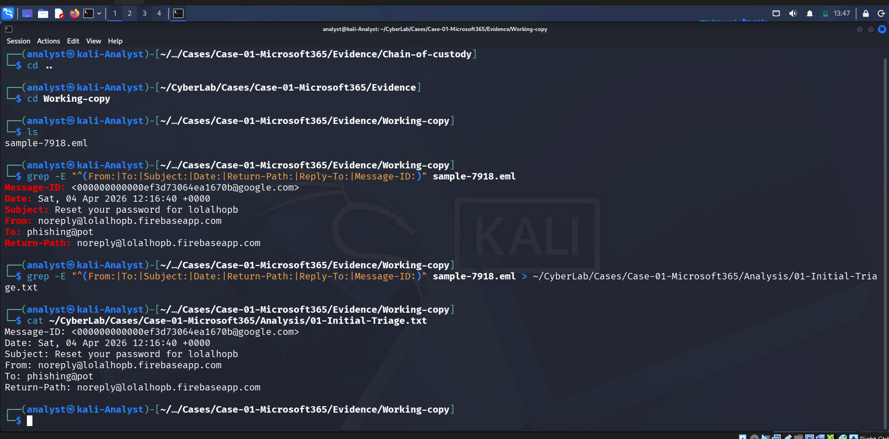
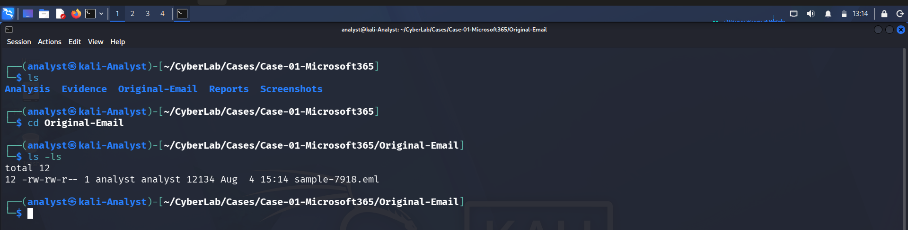

# 01 - Initial Triage

## Summary

An email claiming to be a password reset notification was received for analysis.

## Initial Findings

- Subject: Reset your password for lolalhopp
- Sender: noreply@lolalhopp.firebaseapp.com
- Recipient: phishing@pot
- Date: Sat, 04 Apr 2026 12:16:40 +0000
- Return-Path: noreply@lolalhopp.firebaseapp.com
- Message-ID: <000000000000ef3d73064ea1670b@google.com>

## Initial Assessment

The email claims to be a password reset notification. The sender is not a Microsoft domain and the project name "lolalhopp" appears unusual. Further investigation is required before determining whether the email is malicious.

---

# Investigation Evidence

## Initial Assessment

The email was initially reviewed to determine whether it exhibited characteristics of a phishing attempt.

---

## Original Email

The original email was preserved and reviewed before deeper technical analysis.
