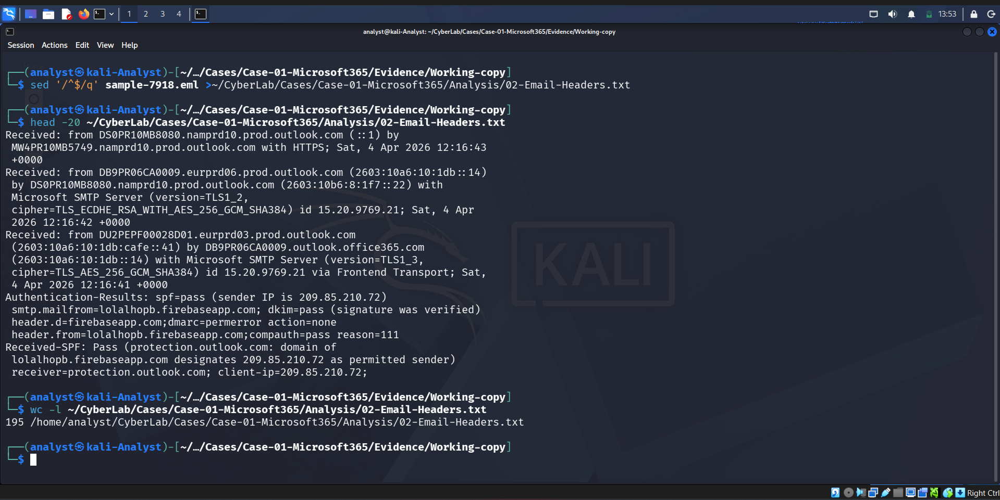
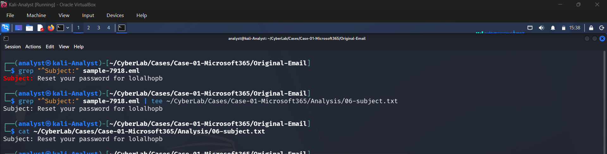
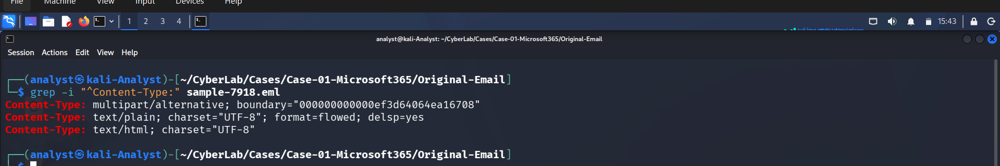
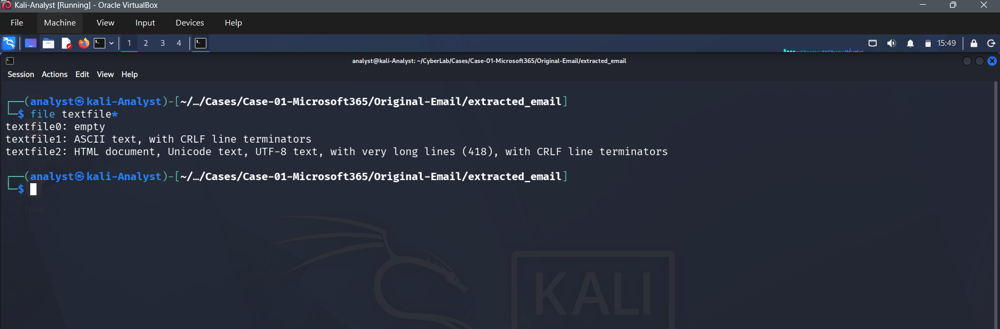
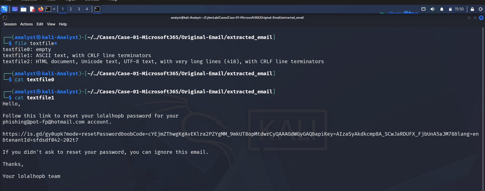
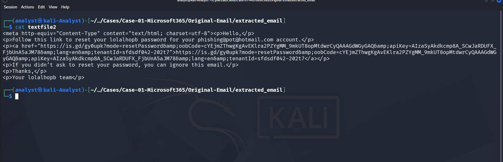

# 02 - Header Analysis

## Objective

Extract and preserve the complete email header for forensic analysis.

## Method

The complete email header was extracted from the working copy using:

```bash
sed '/^$/q' sample-7918.eml
```

---

# Investigation Evidence

## Header Extraction



Email headers were extracted successfully from the original EML file.

---

## Subject Analysis



The subject line was reviewed for indicators of urgency and impersonation.

---

## MIME Analysis



The MIME Content-Type confirmed the structure of the email.

---

## Extracted Body



The extracted email body files were examined for embedded content.

---

## Plain Text Body



Plain text version of the email.

---

## HTML Body



HTML version of the phishing email.


## Results

- Header extracted successfully
- File saved as:
  Analysis/02-Email-Headers.txt

- Total Header Lines:
  195

- Status:
  Complete
