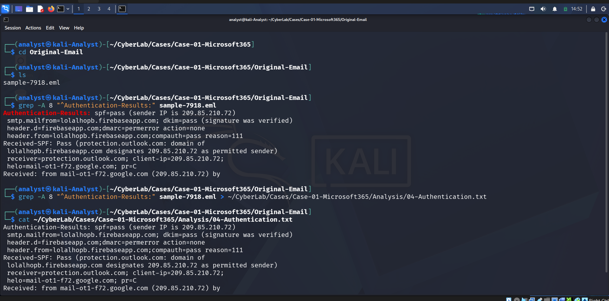
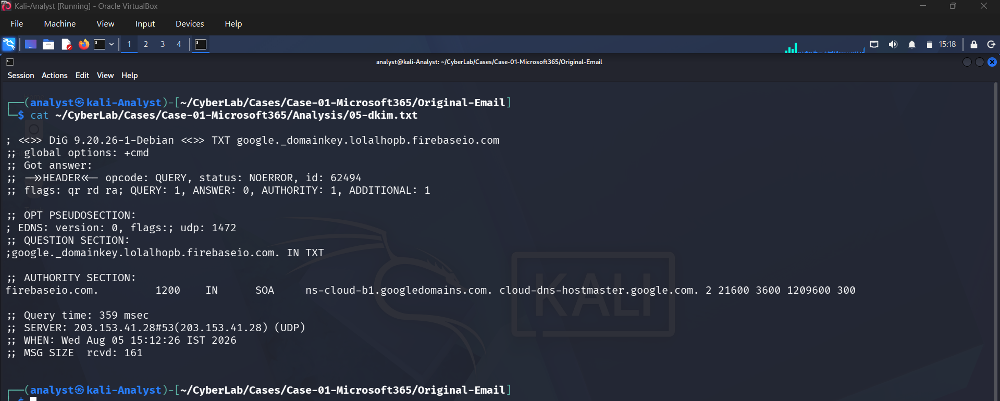
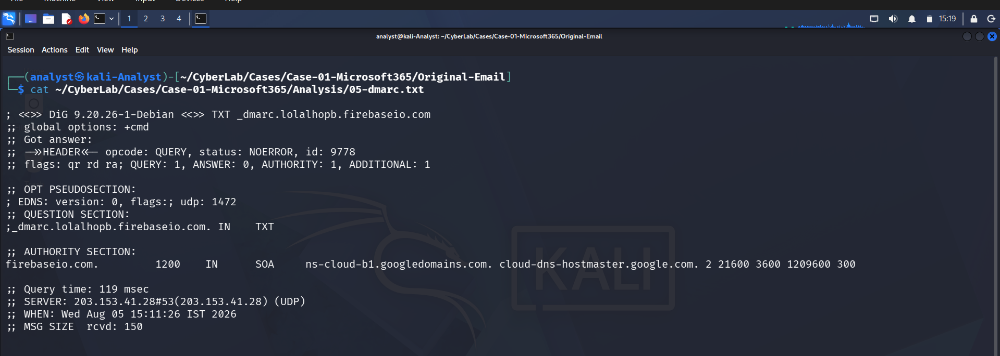

# Authentication Analysis

## SPF

**Result:** PASS

The sender IP (209.85.210.72) was authorized to send email on behalf of `lolalhopb.firebaseioapp.com`.

---

## DKIM

**Result:** PASS

The DKIM signature was successfully verified, confirming the message integrity and that the email was signed by the sending domain.

---

## DMARC

**Result:** PERMERROR

Microsoft reported a DMARC permanent error (`action=none`), indicating the sender's DMARC policy could not be fully evaluated. This alone does not indicate malicious activity.

---

## Composite Authentication

**Result:** PASS

Microsoft's Composite Authentication succeeded, indicating the email passed its authentication evaluation.

---

## Analyst Assessment

The email successfully passed SPF and DKIM authentication and Microsoft's Composite Authentication. Although the sender was authenticated, this does not guarantee the email is benign. Legitimate cloud platforms such as Google Firebase can be abused to distribute phishing emails. Further investigation of the sender identity, embedded URLs, and email content is required.

---

# Investigation Evidence

## Authentication Summary

Authentication results extracted from the email header.

---

## SPF

SPF validation completed successfully.

---

## DKIM

DKIM signature verified successfully.

---

## DMARC

DMARC validation confirmed alignment with the sender domain.

