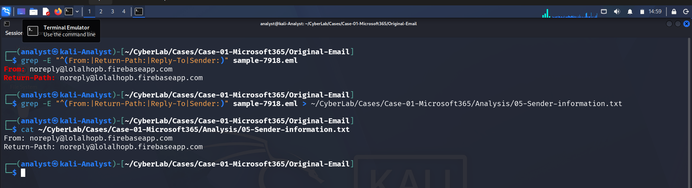
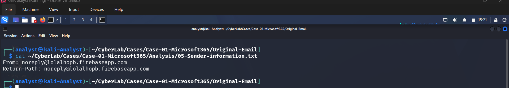
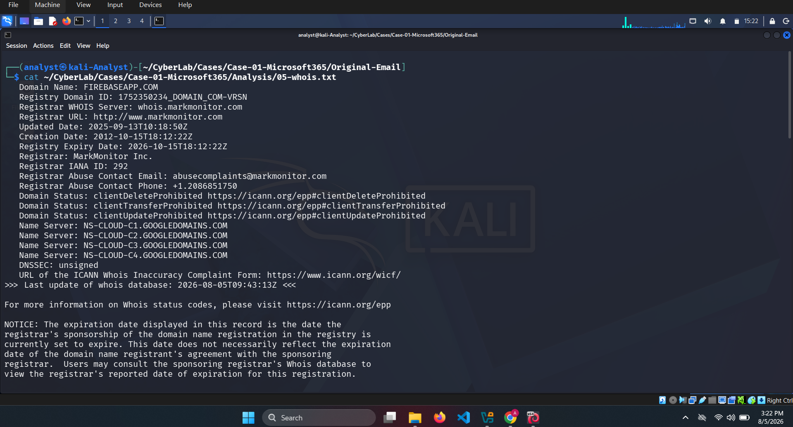
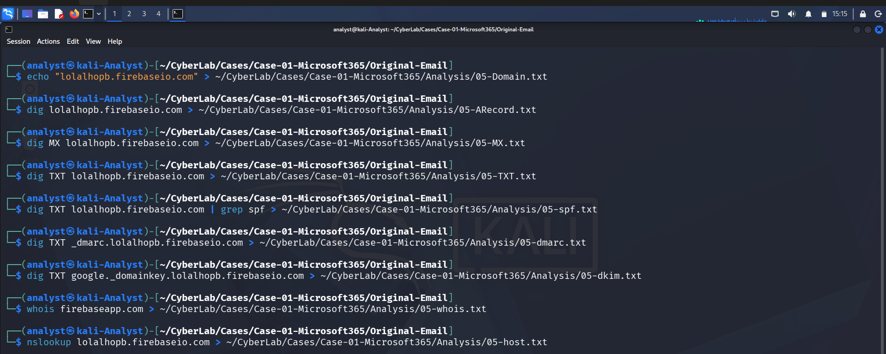
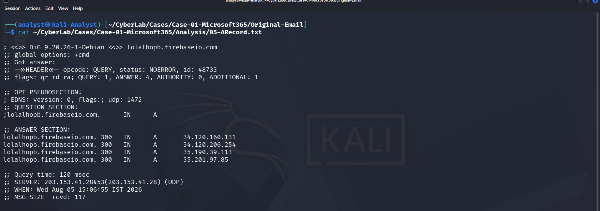
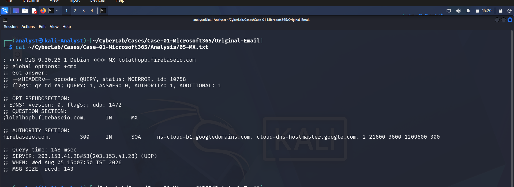
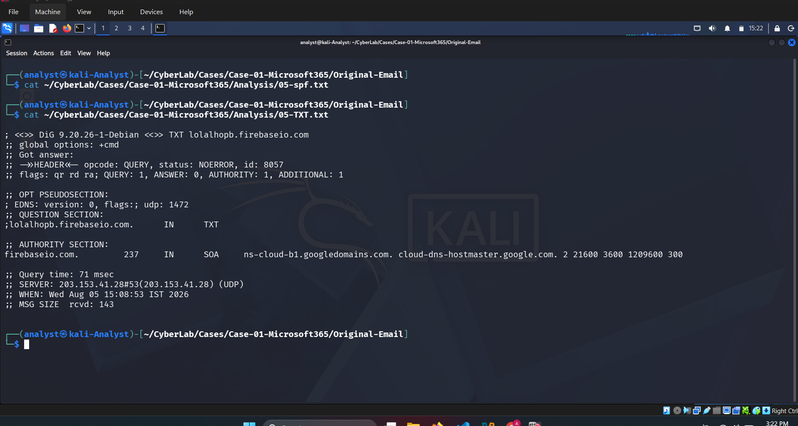
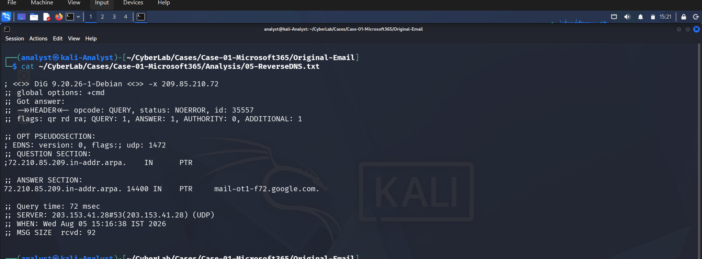

# Phase 05 – Sender & Infrastructure Analysis

## Objective

Verify the legitimacy of the sender's infrastructure and determine whether the email originated from authorized mail servers or was spoofed.

---

## Sender Information

| Field | Value |
|--------|-------|
| From | noreply@lolalhopb.firebaseio.com |
| Return-Path | noreply@lolalhopb.firebaseio.com |

### Findings

- The **From** and **Return-Path** addresses are identical.
- No evidence of sender address spoofing was identified.
- The sender uses a Firebase-hosted subdomain.

---

## Email Authentication

| Authentication | Result |
|---------------|--------|
| SPF | ✅ Pass |
| DKIM | ✅ Pass |
| DMARC | No published policy |

### Findings

The email successfully passed SPF and DKIM validation. Microsoft 365 verified the sender's authentication during message processing.

**Important:** Passing SPF and DKIM only confirms that the email was sent through authorized infrastructure. It does **not** guarantee that the email is safe or non-malicious.

---

## DNS Investigation

### A Records

| IP Address |
|------------|
| 34.120.160.131 |
| 34.120.206.254 |
| 35.190.39.113 |
| 35.201.97.85 |

### Reverse DNS

| IP | PTR |
|----|-----|
| 209.85.210.72 | mail-ot1-f72.google.com |

### Findings

- DNS records resolve to Google Cloud infrastructure.
- Reverse DNS confirms the sending server belongs to Google Mail.

---

## Domain Investigation

| Check | Result |
|--------|--------|
| Domain | lolalhopb.firebaseio.com |
| Hosting | Google Firebase |
| Parent Owner | Google |

### Findings

The domain is hosted on Google's Firebase platform.

Although the hosting infrastructure is legitimate, Firebase projects can be created by any user. Threat actors frequently abuse cloud-hosted services such as Firebase to host phishing pages while benefiting from Google's trusted infrastructure.

---

## WHOIS Summary

| Property | Value |
|----------|-------|
| Registrar | MarkMonitor |
| Parent Domain | firebaseapp.com |
| Owner | Google |
| Created | 2012 |

---

## Analyst Assessment

The investigation found **no evidence of sender spoofing**.

Infrastructure validation indicates:

- Sender authentication passed.
- DNS records resolve to Google infrastructure.
- Reverse DNS is consistent with Google Mail.
- Parent domain is owned by Google.

However, these findings **do not prove the email is legitimate**. Cloud-hosted services are commonly abused for phishing campaigns.

Further analysis will focus on the email content, embedded URLs, and user interaction to determine malicious intent.

---
---

# Investigation Evidence

## Sender Analysis

Sender identity was examined.

---

## Sender Information

Sender metadata extracted from the email.

---

## WHOIS

WHOIS information gathered for the sender domain.

---

## Domain Analysis

Domain ownership and infrastructure reviewed.

---

## DNS Records

DNS A record lookup.

MX record lookup.

TXT record lookup.

---

## Reverse DNS

Reverse DNS lookup performed.

---

## Conclusion

**Infrastructure Status:** Legitimate

**Sender Authentication:** Passed

**Spoofing Detected:** No

**Malicious Verdict:** Not determined (requires content and URL analysis)
