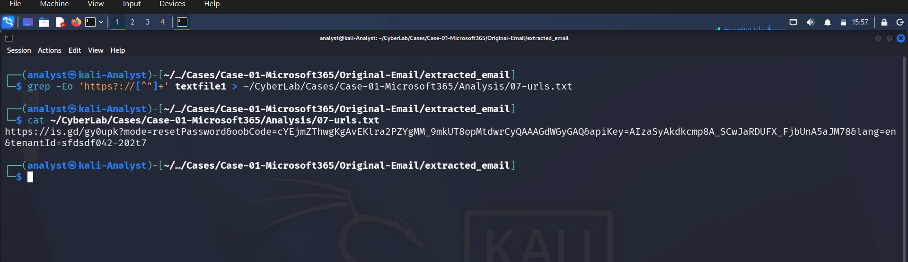
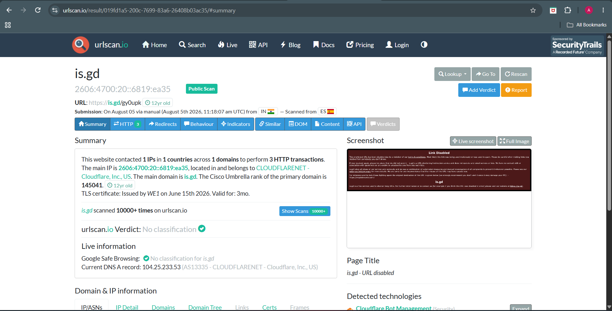
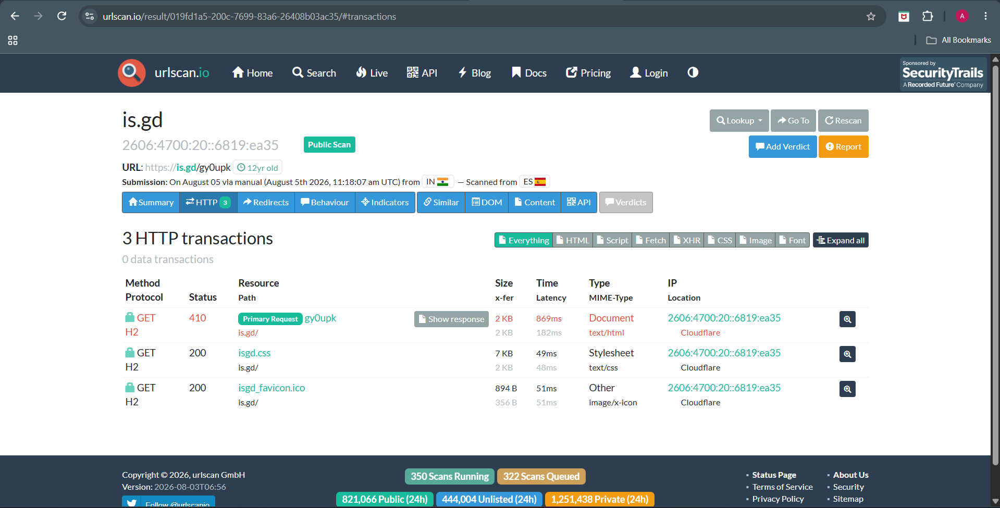

# Phase 07 – URL Analysis

## Objective

Identify and analyze all URLs embedded within the email body to determine whether they redirect to malicious infrastructure or are associated with phishing activity.

---

## Tools Used

- ripMIME
- grep
- tr
- curl
- xxd
- VirusTotal (optional)
- URLScan.io (optional)

---

## Extraction Process

The email was extracted using `ripmime`, producing separate plain text and HTML body files.

```bash
ripmime -i sample-7918.eml -d extracted_email
```

The extracted files were identified as:

```
textfile0   (empty)
textfile1   (Plain Text)
textfile2   (HTML)
```

The phishing URL was extracted from the plain text body.

```bash
grep -oE 'https?://[^ ]+' textfile1 > 07-url.txt
```

---

## Extracted URL

```
https://is.gd/gy0upk?mode=resetPassword&oobCode=<redacted>&apiKey=<redacted>&lang=en&tenantId=<redacted>
```

Sensitive tokens such as **oobCode**, **apiKey**, and **tenantId** have been redacted for documentation purposes.

---

## URL Characteristics

| Property | Observation |
|----------|-------------|
| Protocol | HTTPS |
| URL Type | Shortened URL |
| Shortener | is.gd |
| Theme | Password Reset |
| Service Referenced | Firebase Authentication |
| Embedded Parameters | mode, oobCode, apiKey, lang, tenantId |

---

## Analysis

The URL is presented as a password reset link.

The parameters indicate that the email attempts to mimic a Firebase Authentication password reset workflow.

Key indicators include:

- `mode=resetPassword`
- `oobCode`
- `apiKey`
- `tenantId`

These parameters are commonly present in Firebase password reset emails.

---

## Redirect Analysis

The analyst attempted to follow the shortened URL using `curl`.

```bash
curl -IL "<Extracted URL>"
```

The request returned:

```
curl: (3) URL rejected: Malformed input to a URL function
```

To verify that the extracted file was not corrupted, a hexadecimal inspection was performed.

```bash
xxd 07-final-url.txt
```

The hex dump confirmed:

- No hidden characters
- No UTF-8 BOM
- No NULL bytes
- Valid ASCII encoding

The investigation suggests that the URL contained within the DFIR training sample has likely been intentionally truncated or sanitized to prevent access to a live phishing page.

This behavior is common in forensic training datasets.

---

## Indicators of Compromise (IOC)

| IOC Type | Value |
|-----------|-------|
| URL Shortener | is.gd |
| URL Scheme | HTTPS |
| Attack Theme | Password Reset |
| Referenced Service | Firebase Authentication |

---

## Analyst Assessment

The embedded URL exhibits multiple characteristics commonly associated with credential phishing campaigns:

- Uses a shortened URL (is.gd)
- Mimics a legitimate password reset notification
- References Firebase Authentication
- Attempts to redirect the victim to a password reset workflow

Although the final destination could not be resolved due to the sanitized nature of the training sample, sufficient evidence exists to classify the URL as **highly suspicious**.

---
---

# Investigation Evidence

## URL Extraction



Embedded URLs extracted from the phishing email.

---


## URLScan Summary



URLScan results summarizing observed behaviour.

---

## HTTP Transactions



Network transactions captured by URLScan.

## Conclusion

One shortened HTTPS URL was identified within the email body.

The URL impersonates a Firebase password reset notification and is consistent with credential harvesting techniques. Because the sample appears intentionally sanitized, the final redirect destination could not be validated. Based on the email context and embedded parameters, the URL should be treated as malicious until proven otherwise.
