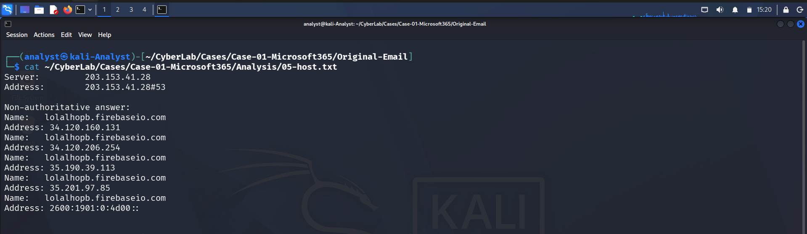

# Phase 09 – IOC Extraction

## Objective

Extract all observable Indicators of Compromise (IOCs) identified during the investigation. These indicators can be used for threat hunting, detection engineering, SIEM correlation, and future incident response activities.

---

# Malicious / Suspicious IOCs

| IOC Type | Indicator | Description |
|----------|-----------|-------------|
| Sender Email | noreply@lolalhopb.firebaseapp.com| Email address used by the attacker. |
| Embedded URL | https://is.gd/gy0upk?mode=resetPassword... | Shortened URL leading to the phishing page. |
| URL Shortener | is.gd | URL shortening service used to conceal the final destination. |
| Target Account | phishing@pot-fp@hotmail.com | Email account referenced within the phishing message. |
| Social Engineering Theme | Microsoft 365 Password Reset | Designed to trick the victim into resetting credentials. |

---

# Legitimate Infrastructure Abused

These indicators belong to trusted services but were abused by the attacker to increase credibility and evade detection.

| IOC Type | Indicator | Description |
|----------|-----------|-------------|
| Sending Mail IP | 209.85.210.72 | Google mail server that delivered the email. |
| Reverse DNS | mail-ot1-f72.google.com | Reverse DNS of the sending mail server. |
| Hosting Domain | lolalhopb.firebaseio.com | Firebase-hosted phishing page. |
| Hosting Provider | Google Firebase | Legitimate cloud hosting platform abused for phishing. |
| Email Provider | Hotmail / Outlook | Legitimate email service used by the attacker. |

---

# Observed Infrastructure

| Item | Value |
|------|-------|
| Mail Server | Google SMTP Infrastructure |
| Cloud Hosting | Firebase Hosting |
| URL Shortening Service | is.gd |
| Email Service | Hotmail / Outlook |

---

# Summary

The phishing campaign abused multiple legitimate cloud services rather than attacker-owned infrastructure.

Observed abuse included:

- Google SMTP servers for email delivery
- Google Firebase Hosting for phishing page hosting
- is.gd URL shortening service to obscure the phishing URL
- Hotmail account used as the sender identity

This technique increases the likelihood of bypassing reputation-based email filtering because the underlying infrastructure is trusted.

---

# IOC Classification

| Indicator | Classification |
|-----------|----------------|
| phishing@pot-fp@hotmail.com | Malicious |
| https://is.gd/... | Malicious |
| is.gd | Suspicious |
| lolalhopb.firebaseio.com | Legitimate Infrastructure (Abused) |
| Google Firebase | Legitimate Infrastructure (Abused) |
| 209.85.210.72 | Legitimate Infrastructure (Abused) |
| mail-ot1-f72.google.com | Legitimate Infrastructure (Abused) |
| Hotmail / Outlook | Legitimate Infrastructure (Abused) |

---

# Detection Opportunities

The extracted IOCs can be used for:

- SIEM detection rules
- Threat hunting
- Email gateway blocking
- URL filtering
- Security awareness training
- IOC enrichment using VirusTotal, URLScan, AbuseIPDB, and other threat intelligence platforms

---
---

# Investigation Evidence

## URL Extraction

Indicators extracted from embedded phishing URLs.

---

## Sender Information

Email-related indicators collected from the message metadata.

---

## Host Information

Infrastructure indicators extracted during routing analysis.

## Phase Outcome

The investigation successfully identified the observable indicators used in the phishing campaign while distinguishing between malicious artifacts and legitimate infrastructure abused by the attacker. This distinction helps prevent false positives while improving detection accuracy.
