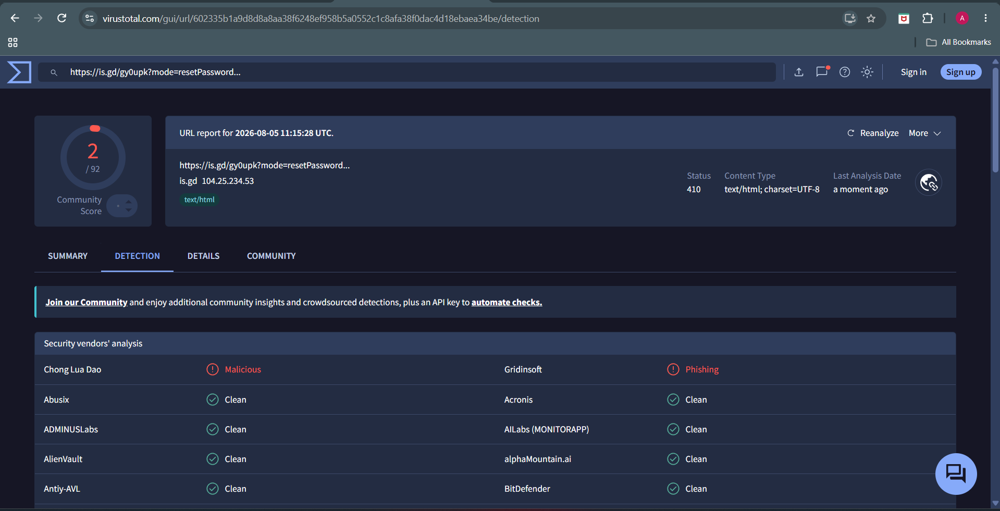
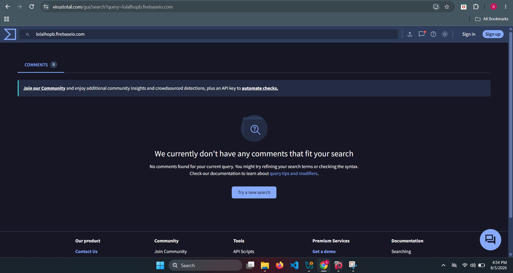
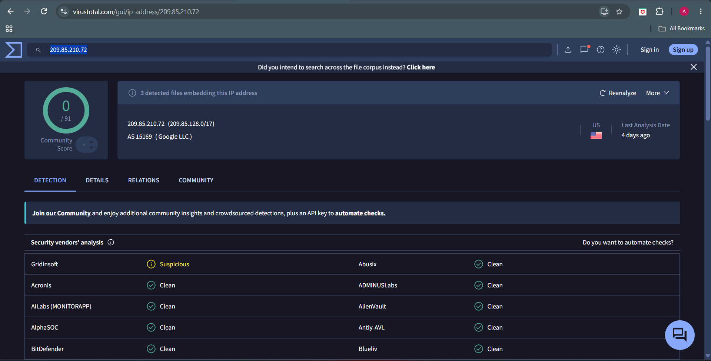
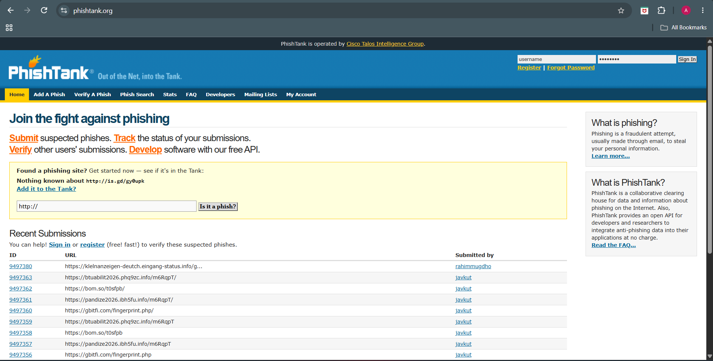
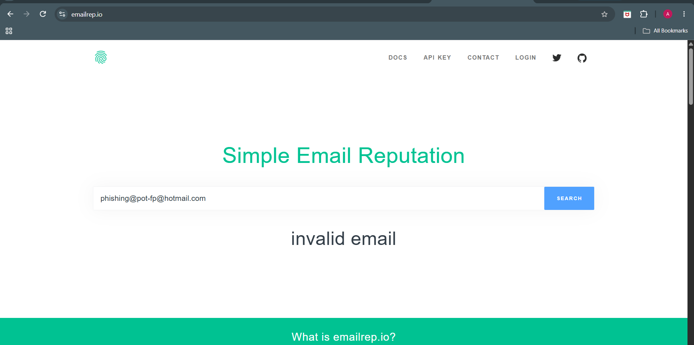

# Phase 10 – Threat Intelligence

## Objective

Determine whether the extracted Indicators of Compromise (IOCs) have been previously reported as malicious by consulting multiple Threat Intelligence platforms.

---

# Threat Intelligence Sources Used

- VirusTotal
- Cisco Talos Intelligence
- AbuseIPDB
- URLScan.io
- PhishTank
- EmailRep

---

# IOC Reputation Analysis

## 1. URL Analysis

**IOC**

```
https://is.gd/gy0upk?mode=resetPassword&oobCode=...
```

### VirusTotal

**Result**

- Detected as malicious/phishing by **2 security vendors**
- Majority of vendors marked the URL as clean
- Indicates limited but confirmed phishing activity

**Verdict**

⚠️ Suspicious

---

### URLScan.io

**Result**

- URL successfully scanned
- HTTP Response: **410 Gone**
- URL currently disabled
- Public scan exists
- Multiple HTTP requests observed during scan

**Verdict**

Previously active phishing infrastructure, now unavailable.

---

### PhishTank

**Result**

- URL not present in the PhishTank database.

**Verdict**

No public phishing report available.

---

# 2. Firebase Domain Analysis

**IOC**

```
lolalhopb.firebaseio.com
```

### Cisco Talos Intelligence

**Result**

- Reputation: **Trusted**
- Network Owner: Google Inc.
- Content Category: Cloud and Data Centers

**Verdict**

Legitimate Google Firebase infrastructure.

The attacker abused trusted cloud hosting rather than compromising the infrastructure itself.

---

### VirusTotal

**Result**

No malicious detections were found for the Firebase domain.

**Verdict**

Clean reputation.

---

# 3. Mail Server IP Analysis

**IOC**

```
209.85.210.72
```

### VirusTotal

**Result**

- 0 / 91 security vendors flagged the IP
- Belongs to Google LLC (AS15169)

**Verdict**

Legitimate Google mail server.

---

### AbuseIPDB

**Result**

- Reports: 381
- Confidence of Abuse: **0%**
- ISP: Google LLC

**Analysis**

Although numerous reports exist, the abuse confidence remains 0%.

This IP belongs to Google's shared mail infrastructure and is commonly used to send legitimate Gmail traffic.

**Verdict**

Not considered malicious.

---

# 4. Email Address Reputation

**IOC**

```
phishing@pot-fp@hotmail.com
```

### EmailRep

**Result**

EmailRep returned **Invalid Email**.

**Analysis**

The email address appears to be invalid or no longer exists.

It was likely created only to support the phishing campaign.

**Verdict**

Suspicious sender identity.

---

# Threat Intelligence Summary

| IOC | Platform | Result | Verdict |
|------|----------|---------|----------|
| is.gd phishing URL | VirusTotal | 2 vendors detected phishing | Suspicious |
| is.gd URL | URLScan | HTTP 410 (Disabled) | Previously Active |
| is.gd URL | PhishTank | Not listed | Unknown |
| lolalhopb.firebaseio.com | Cisco Talos | Trusted | Legitimate Infrastructure |
| lolalhopb.firebaseio.com | VirusTotal | No detections | Clean |
| 209.85.210.72 | VirusTotal | 0 / 91 detections | Legitimate |
| 209.85.210.72 | AbuseIPDB | 381 reports, 0% confidence | Not Malicious |
| phishing@pot-fp@hotmail.com | EmailRep | Invalid Email | Suspicious |

---

# Threat Intelligence Assessment

The investigation indicates that the phishing campaign relied heavily on **trusted third-party infrastructure** rather than attacker-controlled infrastructure.

The attacker abused:

- Google Mail servers
- Google Firebase Hosting
- Cloudflare-backed URL shortening service (is.gd)

Because these services have strong reputations, traditional reputation-based defenses are less effective.

Although the infrastructure itself is legitimate, the shortened URL was detected as phishing by multiple security vendors, confirming malicious use.

---
---

# Investigation Evidence

## VirusTotal



URL reputation analysis.



Domain reputation analysis.



IP reputation analysis.

---

## AbuseIPDB


IP reputation lookup.

---

## Cisco Talos


Infrastructure reputation review.

---

## PhishTank



Phishing verification.

---

## Email Reputation



Email reputation lookup attempt.

# Conclusion

Threat intelligence confirms that this phishing email leveraged legitimate cloud services to evade detection.

No malicious reputation was associated with the sending IP address or Firebase hosting domain.

However, the embedded shortened URL demonstrated phishing activity and represents the primary malicious indicator identified during the investigation.

Overall assessment:

**Confirmed Credential Phishing Campaign utilizing trusted cloud infrastructure.**
