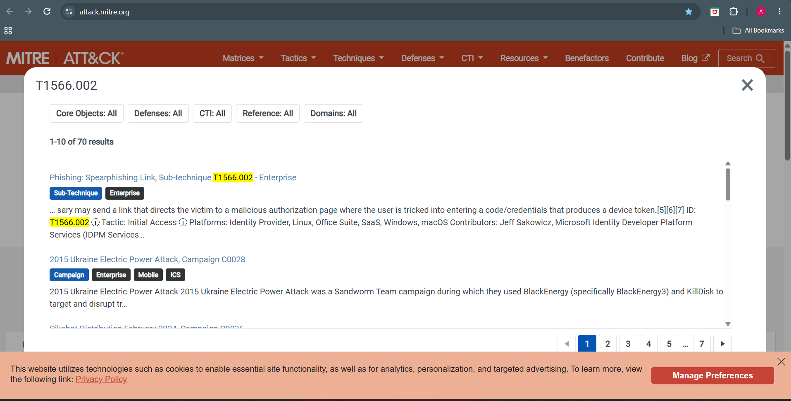
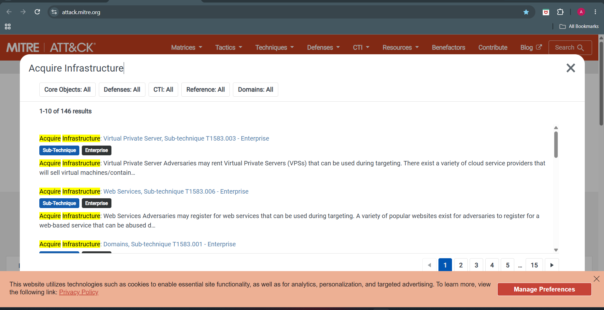
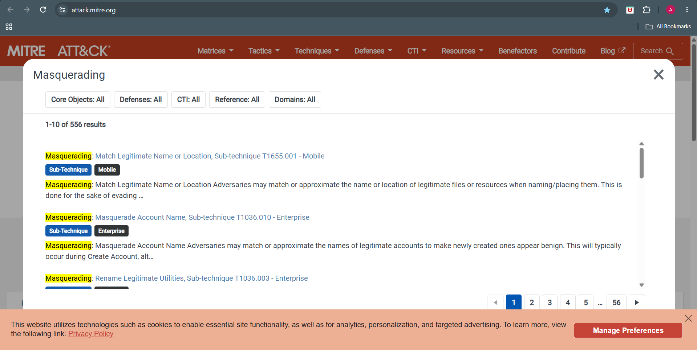
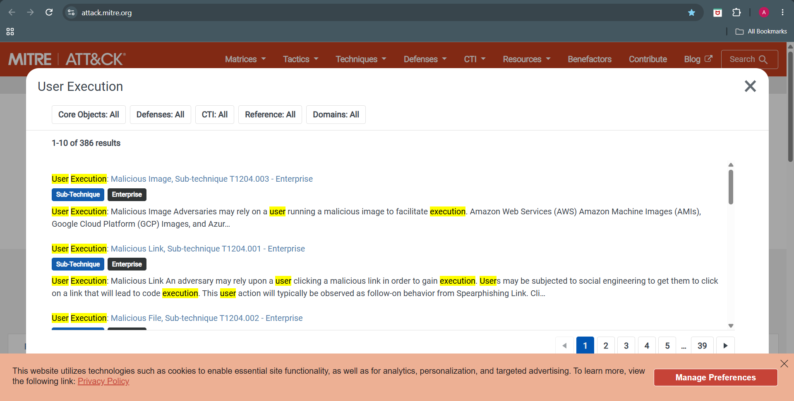

# Phase 11 – MITRE ATT&CK Mapping

## Objective

Map the observed attacker behavior to the MITRE ATT&CK Enterprise Framework based on evidence collected during the investigation.

---

# MITRE ATT&CK Mapping Summary

| Tactic | Technique ID | Technique | Evidence |
|---------|--------------|-----------|----------|
| Initial Access | T1566.002 | Spearphishing Link | Email contained a password reset phishing link. |
| Resource Development | T1583.006 | Acquire Infrastructure: Web Services | Phishing page hosted using Firebase Hosting (Google Cloud). |
| Execution | T1204.001 | User Execution: Malicious Link | Attack requires the victim to click the phishing URL. |
| Defense Evasion | T1036 | Masquerading | Email impersonated Microsoft 365 password reset notification. |

---

# Technique Analysis

---

## 1. T1566.002 – Spearphishing Link

### Tactic
Initial Access

### Description

The attacker attempted to gain initial access by sending a phishing email containing a malicious password reset link.

### Evidence

- Fake Microsoft password reset email
- Embedded shortened URL (is.gd)
- Redirect to Firebase-hosted phishing page
- Social engineering language encouraging immediate action

### Confidence

**High**

---

## 2. T1583.006 – Acquire Infrastructure: Web Services

### Tactic

Resource Development

### Description

The phishing page was hosted using Firebase Hosting, a legitimate cloud web hosting platform owned by Google.

Attackers commonly abuse trusted cloud platforms because they inherit good reputation and are less likely to be blocked.

### Evidence

- Phishing page hosted on

```
lolalhopb.firebaseio.com
```

- Talos Intelligence identified:

```
Network Owner:
Google Inc.

Content Category:
Cloud and Data Centers
```

### Confidence

**Medium-High**

---

## 3. T1204.001 – User Execution: Malicious Link

### Tactic

Execution

### Description

The attack requires user interaction.

The victim must click the phishing link before credentials can be stolen.

### Attack Flow

```
Phishing Email
        │
        ▼
Victim Clicks Link
        │
        ▼
Firebase Phishing Page
        │
        ▼
Credential Theft
```

### Evidence

- Embedded phishing hyperlink
- Password reset theme
- Credential harvesting webpage

### Confidence

**High**

---

## 4. T1036 – Masquerading

### Tactic

Defense Evasion

### Description

The attacker disguised the phishing email as a legitimate Microsoft password reset notification to increase credibility.

Legitimate branding, wording, and cloud infrastructure were used to reduce suspicion.

### Evidence

- Microsoft branding
- Password reset notification
- Legitimate Google/Firebase infrastructure
- URL shortener used to conceal destination

### Confidence

**Medium-High**

---

# Attack Chain

```
Attacker
      │
      ▼
Creates phishing page on Firebase
(T1583.006)
      │
      ▼
Sends Microsoft-themed phishing email
(T1566.002)
      │
      ▼
Victim clicks malicious link
(T1204.001)
      │
      ▼
Credential harvesting page
      │
      ▼
Masquerades as Microsoft
(T1036)
```

---

# MITRE ATT&CK Coverage

| Tactic | Covered |
|----------|----------|
| Resource Development | ✅ |
| Initial Access | ✅ |
| Execution | ✅ |
| Defense Evasion | ✅ |

---

# Analyst Assessment

The investigation identified a credential phishing campaign leveraging trusted cloud infrastructure and URL shortening services to evade detection.

The attacker impersonated Microsoft 365 password reset notifications and relied on user interaction to direct victims to a Firebase-hosted phishing page designed for credential theft.

No malware execution or malicious attachments were observed during this investigation. The attack focused exclusively on credential harvesting through social engineering.

---
---

# Investigation Evidence

## ATT&CK Mapping



Spearphishing Link (T1566.002)

---



Acquire Infrastructure: Web Services (T1583.006)

---



Masquerading (T1036)

---



User Execution (T1204)

# Conclusion

The observed attacker behavior aligns with the following MITRE ATT&CK techniques:

- **T1566.002 – Spearphishing Link**
- **T1583.006 – Acquire Infrastructure: Web Services**
- **T1204.001 – User Execution: Malicious Link**
- **T1036 – Masquerading**

These mappings accurately represent the attack lifecycle observed during the investigation.
