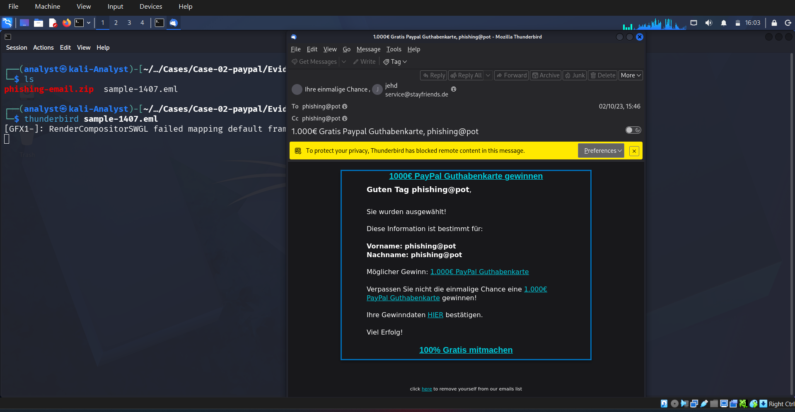
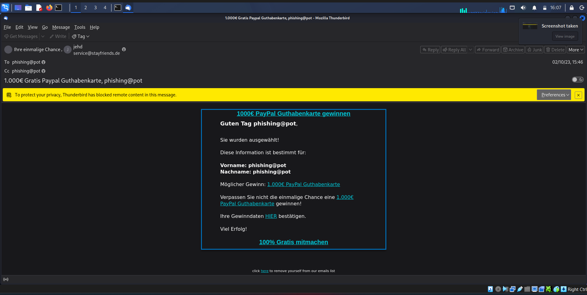
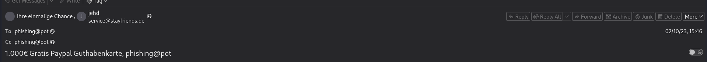
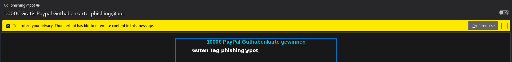
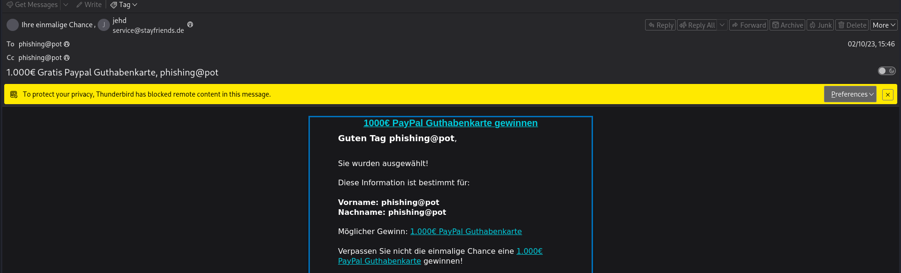
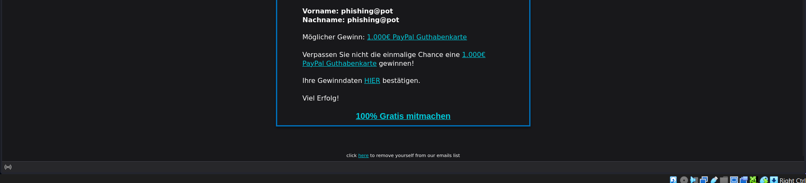
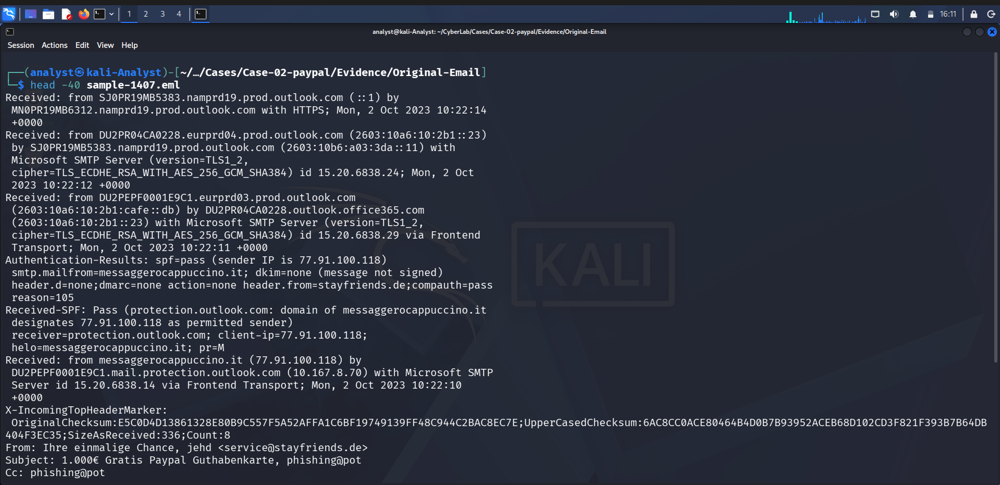

# 🚨 Phase 01 – Initial Triage

---

# 📖 Overview

The **Initial Triage** phase focused on performing a safe preliminary assessment of the suspicious email while preserving the integrity of the original evidence. During this phase, no interaction with embedded hyperlinks, remote content, or external resources was performed.

The email was examined inside an isolated **Kali Linux** virtual machine using **Mozilla Thunderbird** to identify visible phishing indicators before proceeding with detailed forensic analysis.

---

# 🎯 Objective

The objective of this phase was to:

- Preserve the original email evidence.
- Perform a safe visual inspection of the email.
- Identify obvious phishing indicators.
- Determine whether further forensic investigation was required.
- Prevent accidental interaction with attacker-controlled infrastructure.

---

# 🖥️ Investigation Environment

| Item | Value |
|------|-------|
| Case ID | CASE-02 |
| Investigation Type | PayPal Phishing Email |
| Analysis Platform | Kali Linux |
| Email Client | Mozilla Thunderbird |
| Sample | sample-1407.eml |
| Isolation | Virtual Machine |

---

# 🔍 Initial Visual Inspection

The phishing email was opened inside **Mozilla Thunderbird** within an isolated virtual environment.

Immediately after opening the message, Thunderbird displayed a warning indicating that **remote content had been blocked**. This security feature prevents external images, tracking pixels, and other remote resources from loading automatically, reducing the risk of communication with attacker-controlled infrastructure during analysis.

The email impersonated **PayPal** by claiming that the recipient had won a **€1000 PayPal Gift Card** and encouraged the user to claim the reward by clicking embedded hyperlinks.

No file attachments were identified during the initial inspection.

---

# 🚩 Initial Findings

| Observation | Result |
|-------------|--------|
| Brand Impersonation | PayPal |
| Language | German |
| Theme | Gift Card / Prize |
| Social Engineering | Reward-Based |
| Urgency | High |
| Remote Content | Blocked |
| Attachments | None |
| Embedded Hyperlinks | Present |
| HTML Email | Yes |

---

# 📊 Initial Risk Assessment

Several characteristics commonly associated with phishing campaigns were identified during the visual inspection.

- PayPal branding was used to establish trust.
- The email promised a high-value monetary reward.
- Recipients were encouraged to take immediate action.
- Multiple embedded hyperlinks were present.
- Generic recipient targeting was observed.
- The message relied primarily on social engineering rather than technical exploitation.

Based on these observations, the email was classified as **High Risk** and escalated for comprehensive forensic investigation.

---

# 📂 Evidence Collected

The following evidence was documented during the Initial Triage phase:

- Original phishing email
- Email subject
- Sender information
- Thunderbird remote content warning
- Email body
- Embedded hyperlinks (visual inspection)
- Raw email preview

---

# 📸 Screenshots

## Investigation Workspace

---

## Original Email Opened

---

## Sender Information

---

## Remote Content Protection

---

## Email Body (Upper Section)

---

## Email Body (Lower Section)

---

## Raw Email Preview

---

# 💡 Analyst Notes

The email was examined in a controlled virtual environment to preserve evidence integrity and prevent accidental interaction with attacker infrastructure.

During this phase:

- No hyperlinks were clicked.
- No remote content was loaded.
- No attachments were executed.
- The original evidence remained unaltered throughout the investigation.

These precautions ensured that the investigation could proceed safely while maintaining the integrity of the collected evidence.

---

# ✅ Conclusion

The Initial Triage phase confirmed multiple indicators consistent with a phishing campaign, including PayPal brand impersonation, reward-based social engineering, urgent call-to-action messaging, and embedded hyperlinks intended to encourage user interaction.

Although only a preliminary assessment was performed, the findings justified escalation to a full forensic investigation. Subsequent phases focused on detailed analysis of the email headers, routing path, authentication mechanisms, sender identity, embedded URLs, and supporting threat intelligence.

---

# ➡️ Next Phase

Continue to **Phase 02 – Header Analysis** to examine the email headers, sender metadata, routing information, and authentication records.
