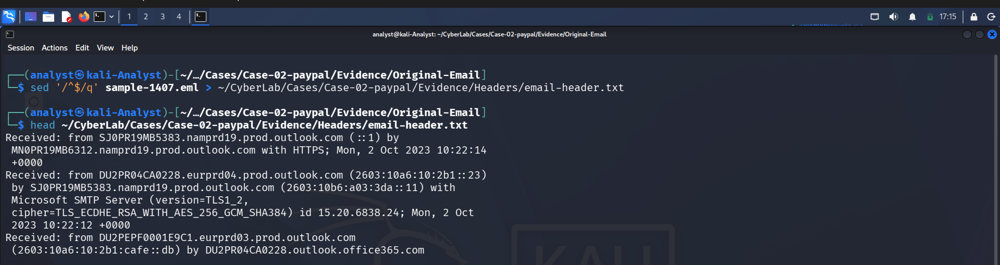
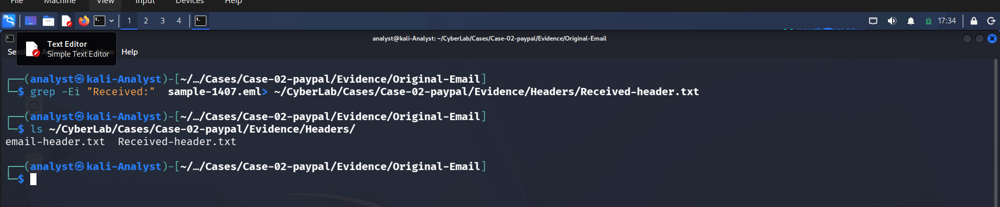
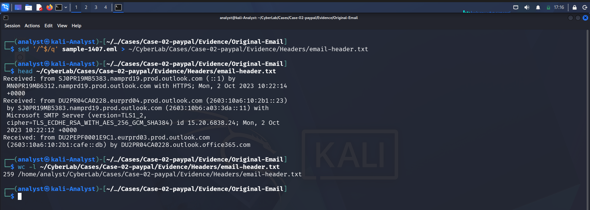
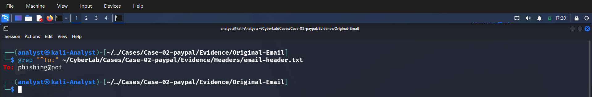
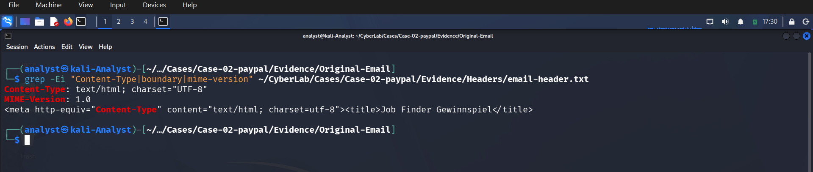
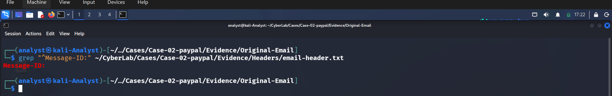
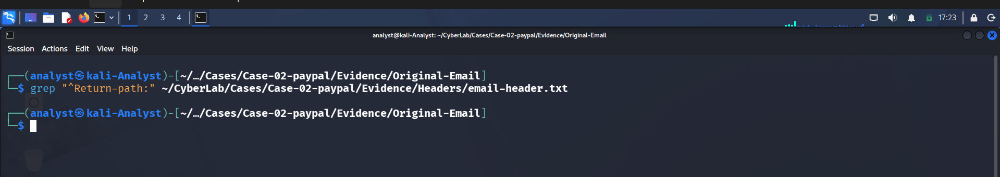

# Phase 02 – Header Analysis

## Objective

The objective of this phase is to extract and examine the email headers from the phishing email. Email headers contain valuable metadata that helps investigators identify the sender, recipient, authentication status, message format, and mail routing information.

This phase focuses on identifying key header fields while leaving detailed Routing Analysis and Authentication Analysis for their dedicated phases.

---

# Header Extraction

The original phishing email was stored in **EML** format.

The header section was extracted using the following command:

```bash
sed '/^$/q' sample-1407.eml > ~/CyberLab/Cases/Case-02-paypal/Evidence/Headers/email-header.txt
```

This command extracts everything from the beginning of the email until the first blank line, which represents the complete email header.

### Screenshot



---

# Header File Verification

After extraction, the generated header file was verified.

Command used:

```bash
head ~/CyberLab/Cases/Case-02-paypal/Evidence/Headers/email-header.txt
```

The output confirmed that the email headers were successfully extracted.

### Screenshot



---

# Header Line Count

The extracted header contains **259 lines**.

Command used:

```bash
wc -l ~/CyberLab/Cases/Case-02-paypal/Evidence/Headers/email-header.txt
```

### Screenshot



---

# Sender Information

Command:

```bash
grep "^From:" ~/CyberLab/Cases/Case-02-paypal/Evidence/Headers/email-header.txt
```

Output:

```text
Ihre einmalige Chance, jehd <service@stayfriends.de>
```

### Observation

- Display name is written in German.
- Sender email belongs to the **stayfriends.de** domain.
- Further reputation analysis will be performed later.

### Screenshot


---

# Recipient Information

Command:

```bash
grep "^To:" ~/CyberLab/Cases/Case-02-paypal/Evidence/Headers/email-header.txt
```

Output:

```text
phishing@pot
```

### Observation

The message was delivered to a phishing analysis mailbox.

### Screenshot



---

# Subject Analysis

Command:

```bash
grep "^Subject:" ~/CyberLab/Cases/Case-02-paypal/Evidence/Headers/email-header.txt
```

Output:

```text
1.000€ Gratis Paypal Guthabenkarte
```

### Observation

The subject claims the recipient has won a free €1000 PayPal gift card.

This is a common phishing lure intended to attract user attention and encourage interaction.

### Screenshot


---

# MIME Version and Content Type

Command:

```bash
grep -Ei "Content-Type|MIME-Version" ~/CyberLab/Cases/Case-02-paypal/Evidence/Headers/email-header.txt
```

Output:

```text
Content-Type: text/html; charset=UTF-8
MIME-Version: 1.0
```

### Observation

The email is delivered as an HTML message using UTF-8 encoding.

HTML emails can contain embedded hyperlinks, images, styling, and other elements commonly used in phishing campaigns.

### Screenshot



---

# Message-ID Analysis

Command:

```bash
grep "^Message-ID:" ~/CyberLab/Cases/Case-02-paypal/Evidence/Headers/email-header.txt
```

Output:

```text
No Message-ID found
```

### Observation

No Message-ID header exists within the email.

Although uncommon, phishing emails may omit this header or intentionally manipulate it.

### Screenshot



---

# Return-Path Analysis

Command:

```bash
grep "^Return-Path:" ~/CyberLab/Cases/Case-02-paypal/Evidence/Headers/email-header.txt
```

Output:

```text
No Return-Path found
```

### Observation

No Return-Path header was present.

Some mail gateways remove or rewrite this field during delivery.

### Screenshot



---

# Authentication Headers

Command:

```bash
grep -Ei "spf|dkim|dmarc|Authentication-Results" sample-1407.eml
```

### Observation

Authentication headers were identified within the email.

A detailed investigation of SPF, DKIM, and DMARC validation is covered in **Phase 04 – Authentication Analysis**.

### Screenshot


---

# Received Headers

Command:

```bash
grep "^Received:" ~/CyberLab/Cases/Case-02-paypal/Evidence/Headers/email-header.txt
```

### Observation

Multiple **Received** headers were identified, indicating the path taken by the email through different mail servers before reaching the recipient.

Detailed mail flow reconstruction is covered in **Phase 03 – Routing Analysis**.

### Screenshot


---

# Summary

The email header was successfully extracted and analyzed.

The following key information was identified:

| Header | Result |
|---------|--------|
| From | service@stayfriends.de |
| To | phishing@pot |
| Subject | 1.000€ Gratis Paypal Guthabenkarte |
| MIME Version | 1.0 |
| Content Type | text/html; charset=UTF-8 |
| Message-ID | Not Present |
| Return-Path | Not Present |
| Authentication Headers | Present |
| Received Headers | Multiple |

The extracted header provides the foundation for the next phases of the investigation:

- Phase 03 – Routing Analysis
- Phase 04 – Authentication Analysis
