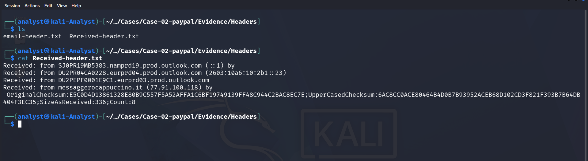
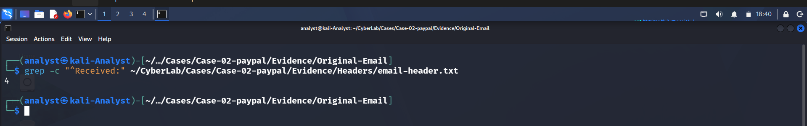
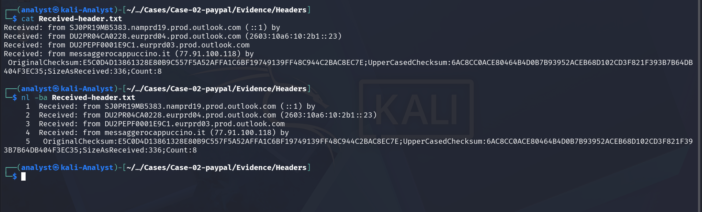

# Routing Analysis

## Objective

The purpose of this phase is to reconstruct the path taken by the phishing email from the sender's mail server to the recipient's mailbox by analyzing the `Received` headers.

Routing analysis helps determine:

- The originating mail server
- Intermediate mail relays
- Final delivery server
- Mail flow consistency
- Presence of any suspicious or unexpected relays

---

# Extracting Received Headers

To isolate only the routing information, the `Received` headers were extracted from the email header.

```bash
grep "^Received:" ~/CyberLab/Cases/Case-02-paypal/Evidence/Headers/email-header.txt \
> ~/CyberLab/Cases/Case-02-paypal/Evidence/Headers/Received-header.txt
```

The extracted routing headers were then reviewed.

### Screenshot



---

# Counting Mail Hops

The total number of routing hops was determined by counting the `Received` headers.

```bash
grep -c "^Received:" ~/CyberLab/Cases/Case-02-paypal/Evidence/Headers/email-header.txt
```

The email passed through **4 routing hops** before reaching the recipient.

### Screenshot



---

# Numbering Routing Hops

Each routing hop was numbered for easier analysis.

```bash
nl -ba ~/CyberLab/Cases/Case-02-paypal/Evidence/Headers/Received-header.txt
```

### Screenshot



---

# Mail Flow Reconstruction

Email routing must always be interpreted **from the bottom Received header to the top**, since each mail server appends its own `Received` header upon receiving the message.

The reconstructed routing path is shown below.

| Hop | Source Server | Destination | Observation |
|------|---------------|-------------|-------------|
| 1 | messaggerocappuccino.it (77.91.100.118) | Microsoft Exchange Online Frontend | Originating mail server |
| 2 | DU2PEPF0001E9C1.eurprd03.prod.outlook.com | Microsoft Exchange Online | Internal Microsoft relay |
| 3 | DU2PR04CA0228.eurprd04.prod.outlook.com | Microsoft SMTP | Internal Microsoft transport |
| 4 | SJ0PR19MB5383.namprd19.prod.outlook.com | Recipient Mailbox | Final mailbox delivery |

---

# Routing Observations

The routing analysis revealed the following:

- The email originated from the server **messaggerocappuccino.it** with IP address **77.91.100.118**.
- After entering Microsoft Exchange Online, the email remained entirely within Microsoft's mail infrastructure.
- Multiple Exchange Online transport servers processed the email before final delivery.
- No unknown third-party relay servers were identified.
- The routing sequence appears consistent with normal Microsoft Exchange Online mail processing.

---

# Analyst Conclusion

The routing headers indicate that the phishing email originated from the domain **messaggerocappuccino.it** before being accepted by Microsoft Exchange Online.

After entering Microsoft's infrastructure, the message followed a normal sequence of internal Exchange Online transport servers until final delivery to the recipient mailbox.

No evidence of unauthorized relay servers or routing manipulation was observed. The routing information supports the conclusion that the email successfully traversed legitimate Microsoft mail infrastructure after being accepted from the originating mail server.

---
