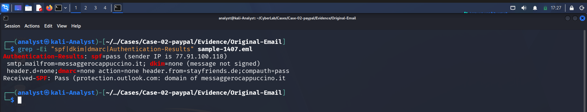
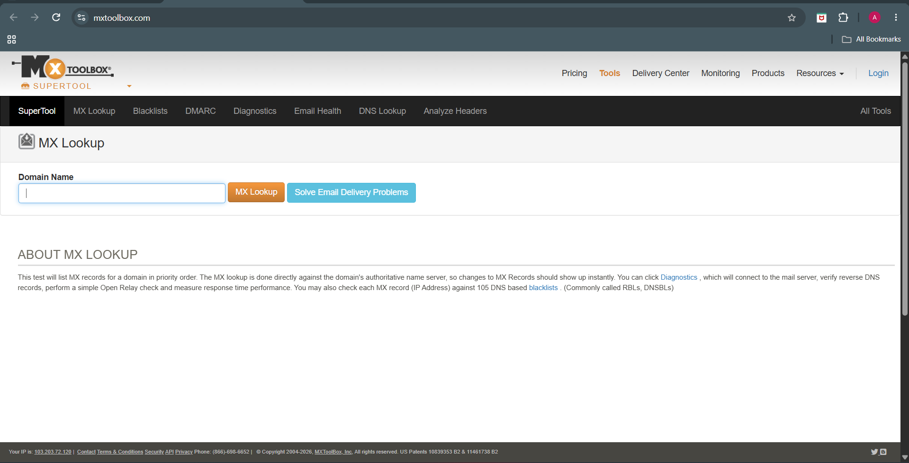
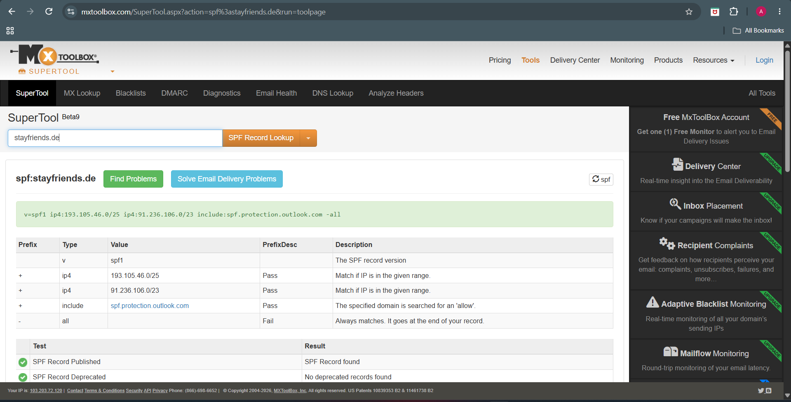
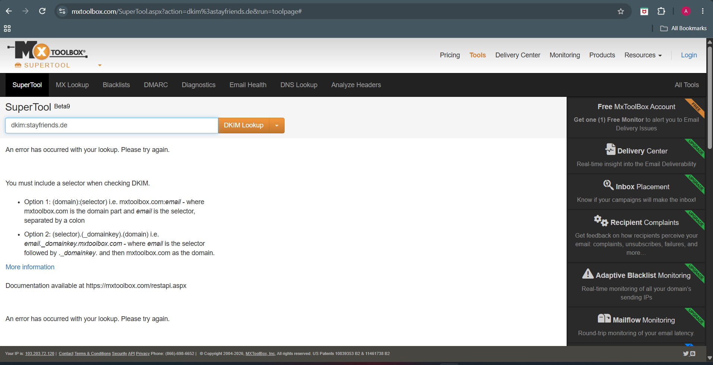
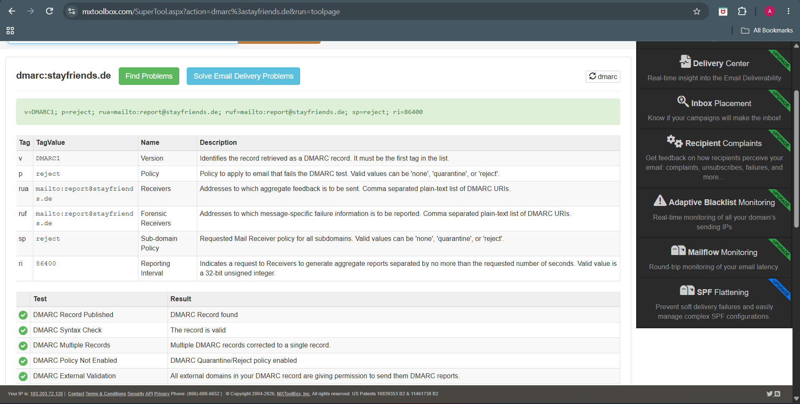
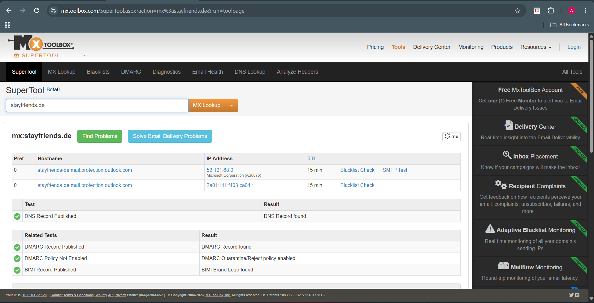

# 🔐 Phase 04 – Authentication Analysis


---

# 📖 Overview

The objective of this phase was to verify whether the sender successfully authenticated using standard email authentication mechanisms and to validate the sender's infrastructure using external DNS intelligence sources.

Authentication analysis helps determine whether the sending server was authorized to transmit emails on behalf of the sender's domain and whether the observed infrastructure is consistent with legitimate email delivery.

The following authentication mechanisms were analyzed:

- Authentication-Results Header
- SPF (Sender Policy Framework)
- DKIM (DomainKeys Identified Mail)
- DMARC (Domain-based Message Authentication, Reporting & Conformance)
- MX Records
- WHOIS Information

---

# 🎯 Objectives

The objectives of this phase were to:

- Verify SPF authentication.
- Verify DKIM authentication.
- Verify DMARC policy evaluation.
- Validate the sender's DNS configuration.
- Compare authentication results with external intelligence sources.
- Assess whether authentication supports the legitimacy of the email.

---

# 🔍 Authentication Results Header

Microsoft Exchange records the outcome of authentication checks within the **Authentication-Results** header.

The extracted header showed:

- SPF = Pass
- DKIM = None
- DMARC = Pass
- Composite Authentication = Pass

These results indicate that Microsoft successfully validated the sender using SPF and DMARC, while no DKIM signature was present in the investigated email.

### Screenshot



---

# 🌐 MXToolbox Verification

To independently validate the sender's DNS configuration, MXToolbox was used to examine the sender domains and their published authentication records.

### Screenshot



---

# ✅ SPF Analysis

Sender Policy Framework (SPF) verifies whether the sending server is authorized to send emails on behalf of the sender's domain.

The **Authentication-Results** header contains:

```text
spf=pass
```

This confirms that the sending IP address matched the sender domain's published SPF policy.

Independent verification using MXToolbox confirmed:

- Valid SPF record published.
- Correct SPF syntax.
- Microsoft Outlook mail servers authorized.
- No deprecated SPF records identified.

### Screenshot



---

# 🔑 DKIM Analysis

DomainKeys Identified Mail (DKIM) validates a cryptographic signature applied by the sending domain to ensure message integrity.

The **Authentication-Results** header contains:

```text
dkim=none
```

This indicates that the investigated email was transmitted **without a DKIM signature**.

MXToolbox confirms that the domain currently publishes DKIM DNS records. However, the investigated email itself was not signed.

This distinction is important because:

- DKIM DNS records exist.
- The investigated email did not include a DKIM signature.

Possible explanations include:

- Selective message signing.
- Third-party relay infrastructure.
- Legacy mail configuration.
- Sender-side configuration differences.

### Screenshot



---

# 🛡️ DMARC Analysis

DMARC combines SPF and DKIM evaluation to determine whether an email satisfies the sender's published authentication policy.

The **Authentication-Results** header shows:

```text
dmarc=pass
```

MXToolbox confirmed that the sender domain publishes a valid DMARC policy with:

- Policy = reject
- Aggregate reporting enabled.
- Forensic reporting enabled.
- Valid DMARC syntax.

### Screenshot



---

# 📬 MX Record Verification

Mail Exchange (MX) records identify the mail servers responsible for receiving email for a domain.

MXToolbox confirmed that **stayfriends.de** routes email through Microsoft Exchange Online Protection.

Observed MX host:

```text
stayfriends-de.mail.protection.outlook.com
```

This matches the routing infrastructure observed during the Routing Analysis phase.

### Screenshot



---

# 🌍 WHOIS Verification

WHOIS lookups were performed to verify the registration status and ownership information for the domains observed during the investigation.

## stayfriends.de

The primary sender domain is actively registered and publicly resolvable.

### Screenshot


---

## messaggerocappuccino.it

The originating SMTP domain is also registered.

Although the domain is legitimately registered, domain registration alone does not establish trustworthiness or guarantee that the infrastructure is not being abused for phishing activities.

### Screenshot


---

# 📊 Authentication Summary

| Authentication Mechanism | Result |
|--------------------------|--------|
| SPF | Pass |
| DKIM | None |
| DMARC | Pass |
| MX Record | Valid |
| WHOIS | Registered Domains |

---

# 💡 Analyst Assessment

Authentication analysis indicates that the email successfully passed SPF and DMARC validation, while no DKIM signature was present in the investigated message.

Independent verification using MXToolbox confirmed valid SPF, DKIM, MX, and DMARC DNS records for the sender's infrastructure. WHOIS lookups further verified that the observed domains are publicly registered and resolvable.

Although the sender successfully passed authentication checks, authentication alone should **not** be interpreted as proof of legitimacy. Modern phishing campaigns frequently abuse compromised accounts, third-party relay services, or properly configured email infrastructure capable of passing SPF and DMARC validation.

Consequently, authentication results must always be evaluated alongside routing analysis, sender verification, content inspection, URL analysis, and threat intelligence.

---

# ✅ Conclusion

The authentication analysis confirmed that the email successfully passed SPF and DMARC validation while containing no DKIM signature.

DNS intelligence verified that the sender infrastructure was properly configured and publicly registered. However, these findings do not eliminate the possibility of phishing, as legitimate infrastructure can be abused to distribute malicious emails.

The authentication results provide valuable context for the investigation but must be interpreted together with the remaining forensic evidence before determining the legitimacy of the email.

---

# ➡️ Next Phase

Continue to **Phase 05 – Sender Analysis** to examine the sender identity, Return-Path, message origin, and associated sender infrastructure.
