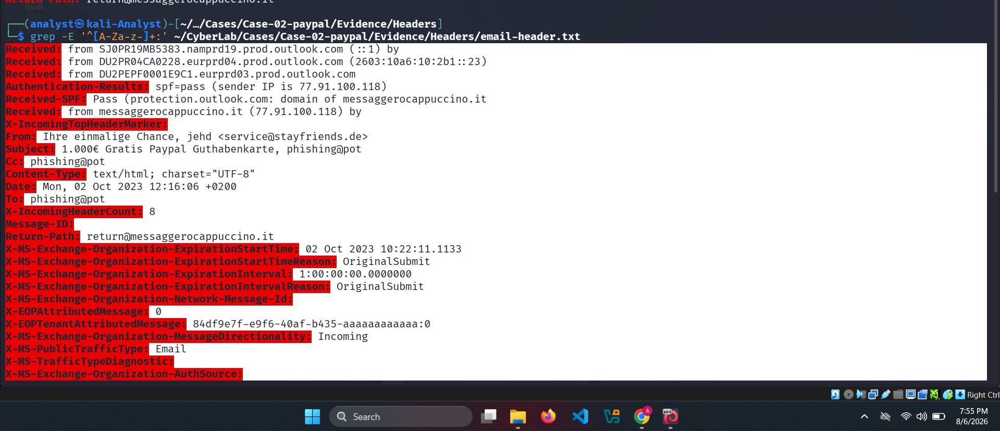
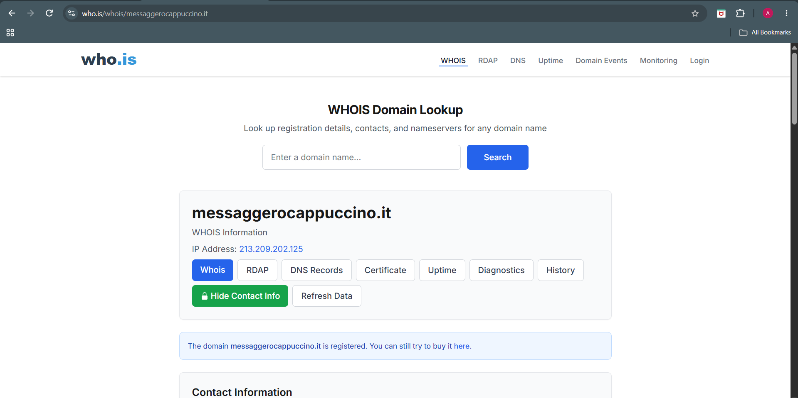

# 👤 Phase 05 – Sender Analysis


---

# 📖 Overview

The purpose of this phase was to analyze the sender-related email headers to identify the visible sender, examine the actual sending infrastructure, and detect inconsistencies that may indicate spoofing, phishing, or the abuse of legitimate email services.

The sender information was correlated with routing, authentication, and WHOIS data to determine whether the sender infrastructure was consistent throughout the investigation.

---

# 🎯 Objectives

The objectives of this phase were to:

- Identify the visible sender.
- Examine the Return-Path address.
- Review sender-related headers.
- Verify Message-ID information.
- Compare the visible sender with the sending infrastructure.
- Validate sender domains using WHOIS.

---

# 👤 Sender (From Header)

The visible sender information was extracted from the email header.

**Command Used**

```bash
grep '^From:' ~/CyberLab/Cases/Case-02-paypal/Evidence/Headers/email-header.txt
```

**Output**

```text
From: Ihre einmalige Chance, jehd <service@stayfriends.de>
```

The display name attempts to attract the recipient's attention, while the visible sender address belongs to the **stayfriends.de** domain.

### Screenshot


---

# 📬 Return-Path Analysis

The Return-Path was extracted using the following command.

**Command Used**

```bash
grep '^Return-Path:' ~/CyberLab/Cases/Case-02-paypal/Evidence/Headers/email-header.txt
```

**Output**

```text
Return-Path: return@messaggerocappuccino.it
```

The Return-Path differs from the visible sender address.

**Visible Sender Domain**

```text
stayfriends.de
```

**Return-Path Domain**

```text
messaggerocappuccino.it
```

This indicates that the email was transmitted using infrastructure associated with **messaggerocappuccino.it** while presenting itself as originating from **stayfriends.de**.

Although differing Return-Path domains can be legitimate, they should always be correlated with authentication results, routing information, and sender verification.

### Screenshot


---

# 🆔 Message-ID Analysis

The **Message-ID** header was examined.

**Observation**

```text
Message-ID:
```

The header is present but does not contain a visible identifier.

Under normal circumstances, the Message-ID contains a unique identifier generated by the sending mail server. A blank or missing value is uncommon and should be documented as part of the investigation.

### Screenshot


---

# 📑 Additional Sender Headers

Additional sender-related headers were manually reviewed.

| Header | Status |
|---------|--------|
| From | Present |
| Return-Path | Present |
| Reply-To | Not Present |
| Sender | Not Present |

No **Reply-To** header was identified.

As a result, replies would default to the address specified in the **From** header.

No **Sender** header was identified.

According to **RFC 5322**, the Sender header is optional and is typically included only when the actual sender differs from the author listed in the From header.

### Screenshot



---

# 🌍 WHOIS Analysis – Visible Sender Domain

The visible sender domain (**stayfriends.de**) was investigated using WHOIS.

The domain is actively registered and publicly resolvable.

Although the domain appears legitimate from a registration perspective, domain registration alone does not establish trustworthiness because attackers may abuse compromised or otherwise legitimate infrastructure.

### Screenshot


---

# 🌍 WHOIS Analysis – Return-Path Domain

The Return-Path domain (**messaggerocappuccino.it**) was also investigated.

The domain is registered and operational.

Its use as the Return-Path domain differs from the visible sender domain and should therefore be evaluated together with the routing, authentication, and threat intelligence findings.

### Screenshot



---

# 📊 Key Findings

| Finding | Result |
|----------|--------|
| Visible Sender | service@stayfriends.de |
| Display Name | Ihre einmalige Chance, jehd |
| Return-Path | return@messaggerocappuccino.it |
| Return-Path Matches Sender | No |
| Reply-To Header | Not Present |
| Sender Header | Not Present |
| Message-ID | Present but Blank |
| WHOIS | Both Domains Registered |

---

# 💡 Analyst Assessment

The sender analysis identified a clear distinction between the visible sender address and the Return-Path domain.

While this configuration is not inherently malicious, it represents an important forensic observation that requires correlation with authentication results, routing information, and threat intelligence.

The absence of Reply-To and Sender headers is not unusual, while the blank Message-ID is an uncommon characteristic that should be documented as part of the overall investigation.

At this stage, the sender information alone is insufficient to determine whether the email is malicious. However, it provides valuable context that supports subsequent phases of the investigation.

---

# ✅ Conclusion

The sender analysis successfully identified the visible sender address, Return-Path domain, and associated sender metadata.

The investigation confirmed that the Return-Path domain differs from the visible sender domain, providing an important indicator for further analysis. When combined with routing analysis, authentication verification, URL investigation, and threat intelligence, these findings contribute to the overall assessment of the phishing campaign.

---

# ➡️ Next Phase

Continue to **Phase 06 – Content Analysis** to examine the HTML structure, social engineering techniques, branding, and embedded content used within the phishing email.
