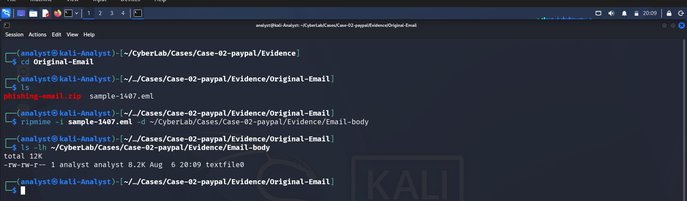
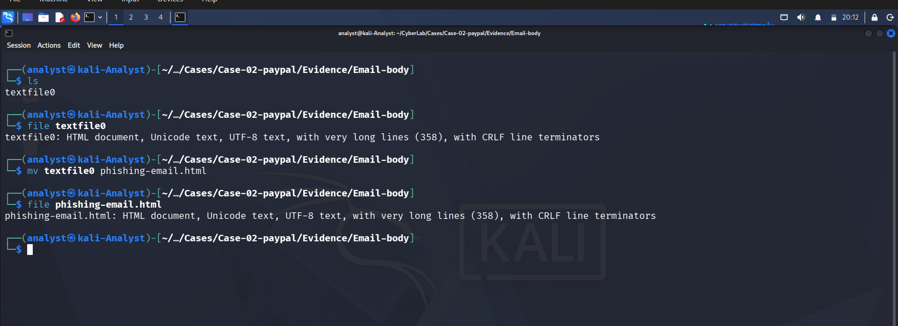
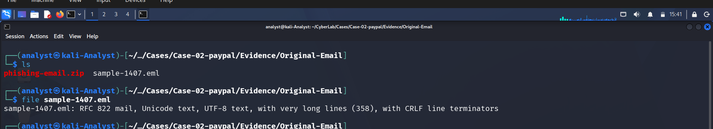
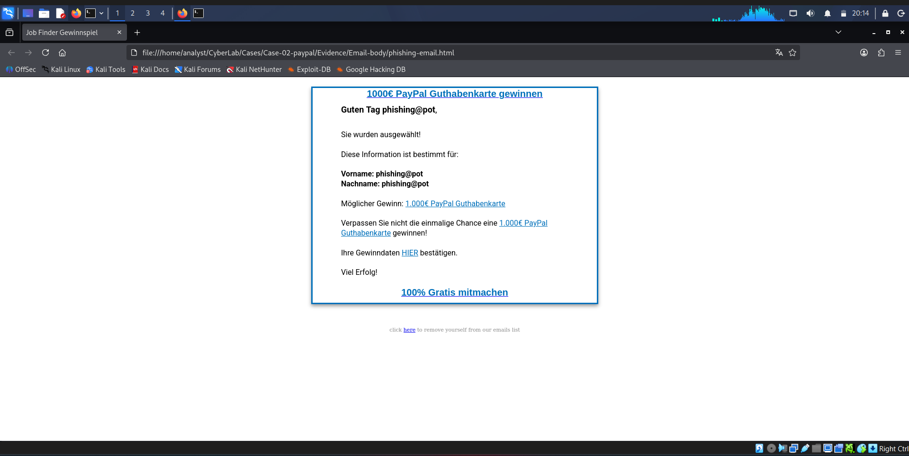
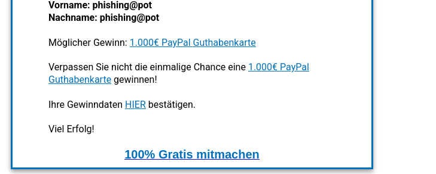
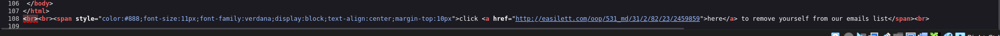
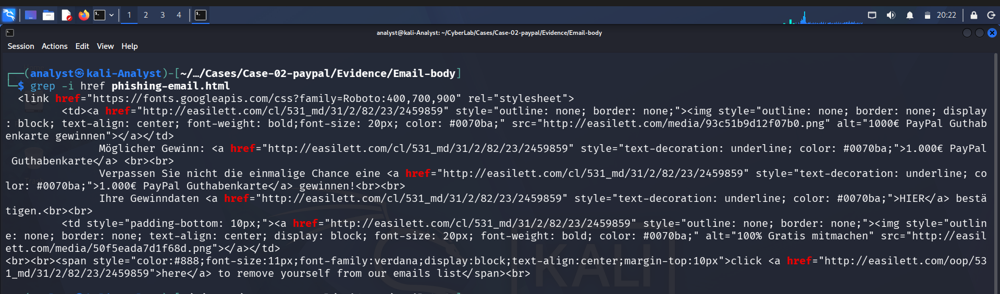
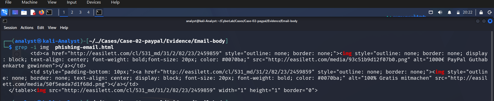

# 📄 Phase 06 – Content Analysis


---

# 📖 Overview

The purpose of this phase was to analyze the extracted HTML email body to identify phishing indicators, embedded content, external resources, and deceptive elements designed to manipulate the recipient.

The investigation focused on identifying social engineering techniques, malicious hyperlinks, externally hosted resources, and other characteristics commonly associated with phishing campaigns.

---

# 🎯 Objectives

The objectives of this phase were to:

- Extract the HTML email body.
- Verify the extracted content.
- Examine the rendered email.
- Identify phishing indicators.
- Analyze embedded hyperlinks and images.
- Detect HTML forms or JavaScript.
- Identify deceptive content used for social engineering.

---

# 📂 Email Body Extraction

The email body was extracted from the original `.eml` file using **ripmime**.

### Command

```bash
ripmime -i sample-1407.eml -d ~/CyberLab/Cases/Case-02-paypal/Evidence/Email-body
```

### Screenshot



---

# ✅ HTML File Verification

The extracted file was verified using the `file` command.

### Command

```bash
file phishing-email.html
```

### Observation

The extracted email body is a valid HTML document encoded in UTF-8 with CRLF line terminators.

### Screenshot



---

# 📧 Original Email Verification

The original email sample was verified before extraction.

### Command

```bash
file sample-1407.eml
```

### Observation

The sample is a valid RFC 822 email message containing HTML content.

### Screenshot



---

# 🖥️ Rendered Email Analysis

The extracted HTML email was rendered locally inside Firefox for visual inspection.

### Command

```bash
firefox phishing-email.html
```

### Observations

- The email is written in German.
- It impersonates a PayPal promotional campaign.
- The recipient is informed that they have won a **1000€ PayPal Gift Card**.
- Personalized information (`phishing@pot`) is included to increase credibility.
- Multiple hyperlinks encourage the recipient to claim the advertised reward.

### Screenshot



---

# 🎯 Call-to-Action Analysis

The email contains multiple hyperlinks encouraging the recipient to claim the advertised reward.

Examples include:

- **HIER bestätigen**
- **100% Gratis mitmachen**

These call-to-action links are designed to redirect victims to attacker-controlled infrastructure.

### Screenshot



---

# 📩 Footer Analysis

The footer contains an unsubscribe-style message intended to increase the perceived legitimacy of the email.

Displayed text:

> click here to remove yourself from our emails list

Although the wording resembles a legitimate unsubscribe mechanism, the associated hyperlink redirects users to an external domain unrelated to PayPal.

### Screenshot


---

# 🔗 Footer Hyperlink Analysis

Inspection of the HTML source revealed that the unsubscribe link redirects to:

```text
http://easilett.com/oop/531_md/31/2/82/23/2459859
```

The destination domain is unrelated to PayPal and represents another strong phishing indicator.

### Screenshot



---

# 🌐 Embedded Hyperlinks

Embedded hyperlinks were extracted using:

```bash
grep -i href phishing-email.html
```

### Findings

Multiple hyperlinks reference:

```text
http://easilett.com/
```

instead of legitimate PayPal infrastructure.

This strongly supports the conclusion that the email was designed to redirect victims to an attacker-controlled website.

### Screenshot



---

# 🖼️ Embedded Images

Image references were extracted using:

```bash
grep -i img phishing-email.html
```

### Findings

The email loads externally hosted images from:

```text
http://easilett.com/media/
```

rather than official PayPal infrastructure.

These externally hosted images are intended to imitate a legitimate promotional email while allowing the attacker to control the visual content.

### Screenshot



---

# 📝 HTML Form Analysis

The HTML source was examined for embedded forms.

### Command

```bash
grep -i form phishing-email.html
```

### Finding

No HTML forms were identified.

The phishing campaign relies on redirecting victims to an external website instead of collecting credentials directly within the email body.

*(Insert screenshot if available.)*

---

# ⚙️ JavaScript Analysis

The HTML source was examined for embedded JavaScript.

### Command

```bash
grep -i script phishing-email.html
```

### Finding

No JavaScript was identified.

The phishing campaign relies entirely on embedded hyperlinks rather than client-side scripting.

*(Insert screenshot if available.)*

---

# 📊 Content Analysis Summary

| Indicator | Result |
|-----------|--------|
| HTML Email | ✅ Present |
| Personalized Content | ✅ Present |
| PayPal Impersonation | ✅ Present |
| External Hyperlinks | ✅ Present |
| External Images | ✅ Present |
| Call-to-Action Links | ✅ Present |
| Fake Unsubscribe Link | ✅ Present |
| HTML Forms | ❌ Not Present |
| JavaScript | ❌ Not Present |

---

# 💡 Analyst Assessment

The content analysis identified multiple characteristics commonly associated with phishing campaigns.

The email combines trusted branding, personalized content, persuasive social engineering, and multiple call-to-action hyperlinks to encourage user interaction. Rather than collecting credentials directly within the email, the attacker relies on redirecting victims to externally hosted infrastructure under their control.

The absence of embedded forms and JavaScript indicates that the phishing campaign depends primarily on deception and external landing pages instead of exploiting vulnerabilities within the recipient's email client.

---

# ✅ Conclusion

The content analysis confirms that the email is consistent with a phishing campaign impersonating a PayPal promotional message.

Key phishing indicators identified during this phase include:

- PayPal brand impersonation.
- Personalized recipient information.
- Multiple call-to-action hyperlinks.
- Externally hosted images.
- Hyperlinks directing users to **easilett.com**.
- Fake unsubscribe mechanism.
- HTML formatting designed to resemble a legitimate promotional email.

Although the email does not contain embedded forms or JavaScript, it is clearly designed to lure recipients to attacker-controlled infrastructure where credential harvesting or additional phishing activity is expected to occur.

---

# ➡️ Next Phase

Continue to **Phase 07 – URL Analysis** to examine the embedded URLs, destination domains, redirects, and associated threat intelligence.
