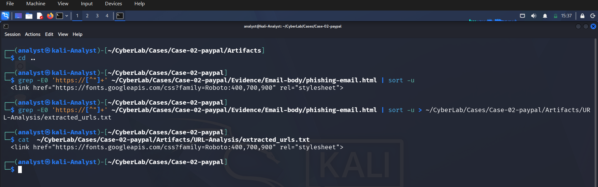

# URL & Domain Analysis

## Objective

The objective of this phase was to investigate the URLs and domains embedded in the phishing email to determine whether they were malicious. Static analysis was performed using Linux command-line tools and multiple OSINT platforms.

---

# Step 1 – Extract HTTPS URLs from the Email

The phishing email HTML file was searched to identify all embedded HTTPS links.

### Command

```bash
grep -Eo 'https://[^"]+' ~/CyberLab/Cases/Case-02-paypal/Evidence/Email-body/phishing-email.html | sort -u
```

The extracted URLs were saved for later analysis.

```bash
grep -Eo 'https://[^"]+' ~/CyberLab/Cases/Case-02-paypal/Evidence/Email-body/phishing-email.html | sort -u > ~/CyberLab/Cases/Case-02-paypal/Artifacts/URL-Analysis/extracted_urls.txt
```

Verify:

```bash
cat ~/CyberLab/Cases/Case-02-paypal/Artifacts/URL-Analysis/extracted_urls.txt
```

### Screenshot



---

# Step 2 – Extract Domain Name

The domain name was extracted from the URL list.

### Command

```bash
awk -F/ '{print $3}' extracted_urls.txt | sort -u
```

Save output:

```bash
awk -F/ '{print $3}' extracted_urls.txt | sort -u > domains.txt
```

Verify:

```bash
cat domains.txt
```

### Result

```
fonts.googleapis.com
```

Only Google's font service was directly referenced using HTTPS.

### Screenshot


---

# Step 3 – Investigate easilett.com

During manual inspection of the HTML source, multiple HTTP links pointed to:

```
easilett.com
```

This became the primary investigation target.

---

# Step 4 – DNS Resolution

DNS records were queried.

### Command

```bash
dig easilett.com
```

Save output:

```bash
dig easilett.com > dig.txt
```

### Result

IP Address:

```
168.76.87.16
```

### Screenshot


---

# Step 5 – Host Lookup

### Command

```bash
host easilett.com
```

### Result

```
easilett.com has address 168.76.87.16
```

### Screenshot


---

# Step 6 – WHOIS Lookup

WHOIS information was collected.

### Command

```bash
whois easilett.com
```

Saved as

```
whois.txt
```

### Findings

- Domain registered: October 22, 2025
- Registrar: Name SRS AB
- Status: Active
- Name Servers:
  - a3.share-dns.com
  - b3.share-dns.net

### Screenshot


---

# Step 7 – MXToolbox Analysis

Multiple DNS and email security checks were performed.

## MX Record

No mail server (MX record) was configured.

Screenshot:


---

## SPF Record

No SPF record was found.

This increases the risk of email spoofing.

Screenshot:


---

## DMARC Record

No DMARC policy was configured.

Without DMARC protection, phishing emails are easier to spoof.

Screenshot:


---

## DNS Lookup

DNS lookup confirmed:

IP Address

```
168.76.87.16
```

Screenshot:


---

# Step 8 – VirusTotal Analysis

VirusTotal reputation lookup was performed.

## Detection

Only

```
1 / 91
```

security vendors detected the domain as malicious.

Vendor:

```
Fortinet
```

Classification:

```
Phishing
```

Screenshots:


---

# Step 9 – URLScan.io

The domain was analyzed using URLScan.

Findings:

- HTTP transactions observed
- Multiple redirects
- External links identified
- Historical scans available

Screenshots:


---

# Step 10 – Cisco Talos Reputation

Cisco Talos classified the domain reputation as:

```
Neutral
```

No Talos blocklisting was present.

Screenshot:


---

# Step 11 – AbuseIPDB

The resolved IP address

```
168.76.87.16
```

was checked.

Result:

- No abuse reports
- Confidence of abuse: 0%

Screenshot:


---

# Analysis Summary

| Item | Result |
|------|--------|
| Primary Suspicious Domain | easilett.com |
| Resolved IP | 168.76.87.16 |
| MX Record | Not Found |
| SPF Record | Missing |
| DMARC Record | Missing |
| VirusTotal | 1/91 flagged as phishing |
| Cisco Talos | Neutral |
| AbuseIPDB | No reports |
| WHOIS | Newly registered domain |
| Risk Assessment | **High** |

---

# Conclusion

The phishing email redirected users to the domain **easilett.com**, which exhibits multiple indicators commonly associated with phishing infrastructure.

Key observations include:

- Newly registered domain
- Missing SPF and DMARC records
- Lack of legitimate email configuration
- Flagged as phishing by VirusTotal
- Hosted on external infrastructure
- Embedded within a PayPal-themed phishing email

Although not all threat intelligence platforms marked the domain as malicious, the combination of infrastructure weaknesses and its direct use within the phishing campaign strongly indicates that the domain should be treated as **malicious**.

**Final Verdict:** 🔴 High Confidence Phishing Infrastructure
