# 🌐 Phase 07 – URL & Domain Analysis


---

# 📖 Overview

The purpose of this phase was to investigate the URLs and domains embedded within the phishing email to determine whether they were associated with malicious infrastructure. Static analysis was performed using Linux command-line tools and multiple Open-Source Intelligence (OSINT) platforms to validate the extracted domains.

The investigation focused on identifying suspicious domains, resolving their infrastructure, validating DNS configurations, and assessing their reputation using publicly available threat intelligence sources.

---

# 🎯 Objectives

The objectives of this phase were to:

- Extract URLs embedded within the phishing email.
- Identify associated domain names.
- Investigate suspicious domains.
- Validate DNS and WHOIS information.
- Perform reputation analysis using multiple OSINT platforms.
- Determine whether the identified infrastructure should be considered malicious.

---

# 📂 Step 1 – Extract HTTPS URLs from the Email

The phishing email HTML file was searched to identify all embedded HTTPS links.

### Command

```bash
grep -Eo 'https://[^"]+' ~/CyberLab/Cases/Case-02-paypal/Evidence/Email-body/phishing-email.html | sort -u
```

The extracted URLs were saved for later analysis.

```bash
grep -Eo 'https://[^"]+' ~/CyberLab/Cases/Case-02-paypal/Evidence/Email-body/phishing-email.html | sort -u > ~/CyberLab/Cases/Case-02-paypal/Artifacts/URL-Analysis/extracted_urls.txt
```

Verification:

```bash
cat ~/CyberLab/Cases/Case-02-paypal/Artifacts/URL-Analysis/extracted_urls.txt
```

### Screenshot


---

# 🌍 Step 2 – Extract Domain Name

The domain names were extracted from the URL list.

### Command

```bash
awk -F/ '{print $3}' extracted_urls.txt | sort -u
```

Save output:

```bash
awk -F/ '{print $3}' extracted_urls.txt | sort -u > domains.txt
```

Verification:

```bash
cat domains.txt
```

### Result

```text
fonts.googleapis.com
```

Only Google's font service was directly referenced using HTTPS.

### Screenshot

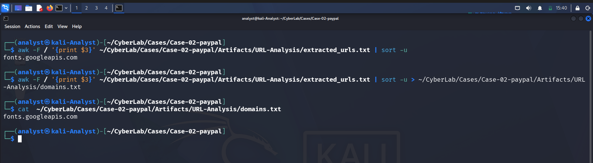

---

# 🚨 Step 3 – Investigate easilett.com

During manual inspection of the HTML source, multiple HTTP links pointed to:

```text
easilett.com
```

Because this domain hosted the embedded hyperlinks and image resources used within the phishing email, it became the primary target for further investigation.

---

# 🌐 Step 4 – DNS Resolution

DNS records were queried to determine the IP address associated with the suspicious domain.

### Command

```bash
dig easilett.com
```

Save output:

```bash
dig easilett.com > dig.txt
```

### Result

```text
168.76.87.16
```

### Screenshot

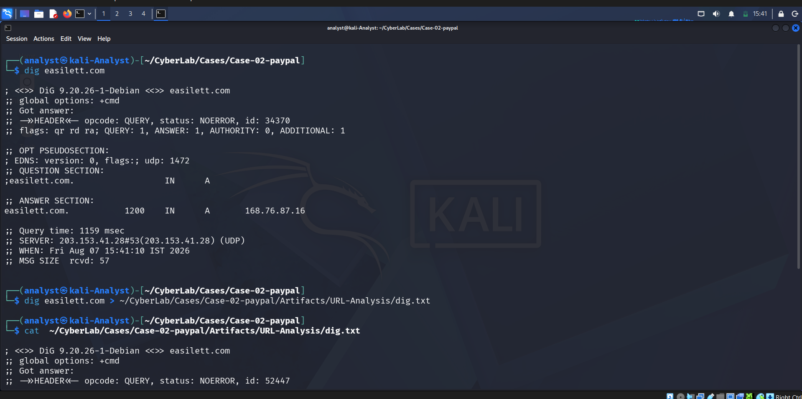

---

# 🖥️ Step 5 – Host Lookup

### Command

```bash
host easilett.com
```

### Result

```text
easilett.com has address 168.76.87.16
```

### Screenshot

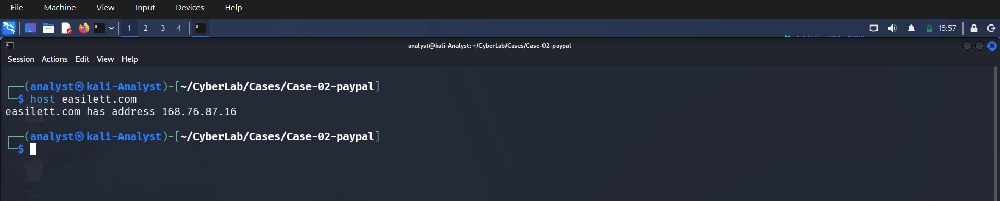

---

# 📑 Step 6 – WHOIS Lookup

WHOIS information was collected to identify the registration details of the suspicious domain.

### Command

```bash
whois easilett.com
```

Saved as:

```text
whois.txt
```

### Findings

- Domain Registered: October 22, 2025
- Registrar: Name SRS AB
- Status: Active
- Name Servers:
  - a3.share-dns.com
  - b3.share-dns.net

### Screenshot

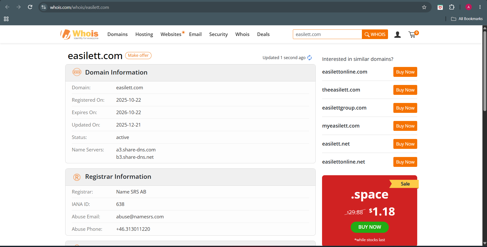

---

# 📬 Step 7 – MXToolbox Analysis

Multiple DNS and email security checks were performed using MXToolbox.

## MX Record

No MX record was configured for the domain.

This indicates that the domain is not configured to receive email.

Screenshot:

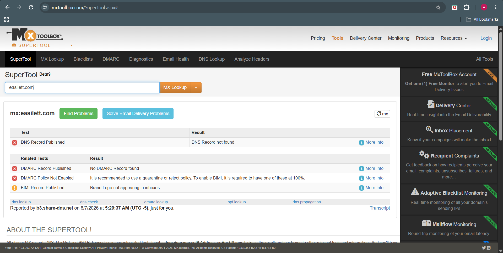

---

## SPF Record

No SPF record was identified.

The absence of an SPF policy increases the likelihood of email spoofing.

Screenshot:

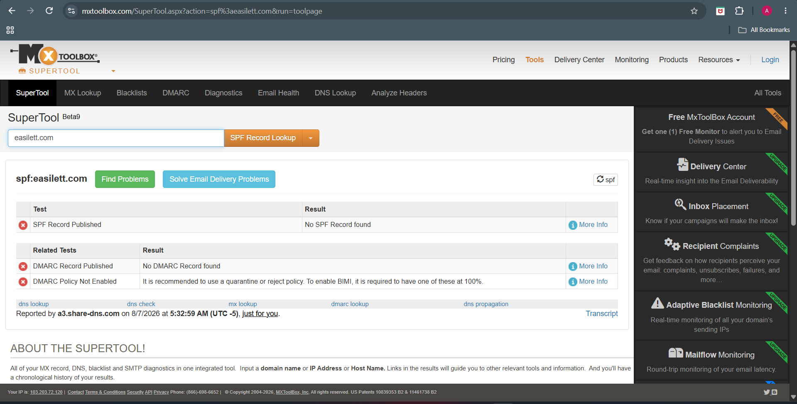

---

## DMARC Record

No DMARC policy was configured.

Without DMARC enforcement, phishing emails are easier to spoof and more difficult to detect.

Screenshot:


---

## DNS Lookup

DNS resolution confirmed the following IP address:

```text
168.76.87.16
```

Screenshot:


---

# 🛡️ Step 8 – VirusTotal Analysis

A reputation lookup was performed using VirusTotal.

### Detection

```text
1 / 91
```

security vendors classified the domain as malicious.

**Vendor**

```text
Fortinet
```

**Classification**

```text
Phishing
```

Screenshots:

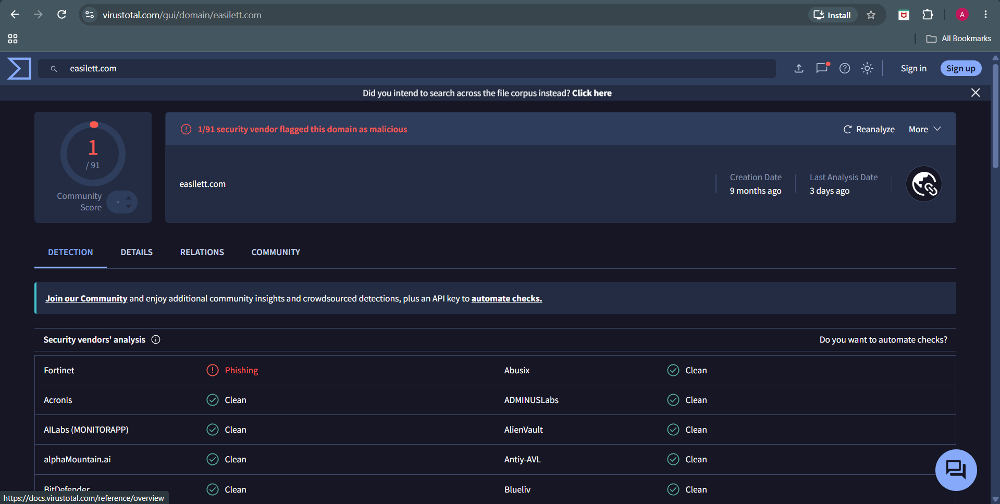

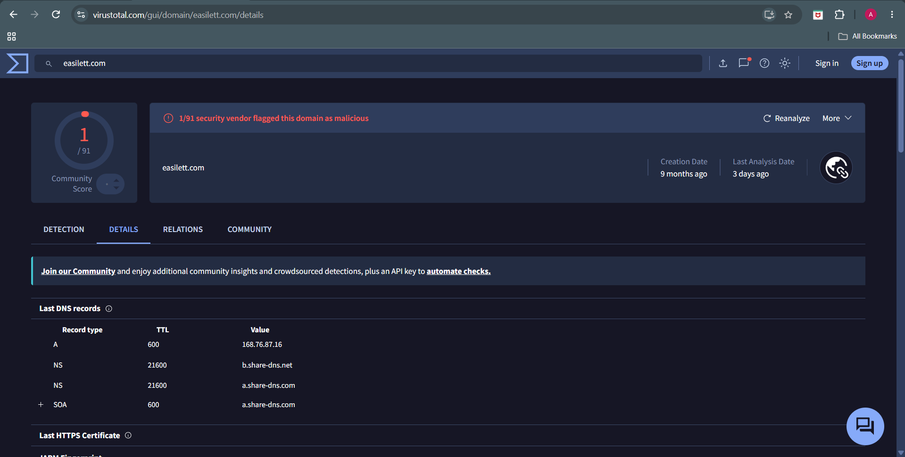

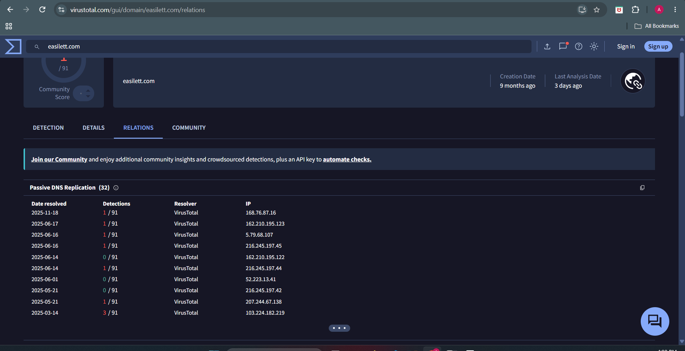

---

# 🔍 Step 9 – URLScan.io Analysis

The domain was investigated using URLScan.io.

### Findings

- HTTP transactions observed.
- Multiple redirects identified.
- External resources detected.
- Historical scan data available.

Screenshots:


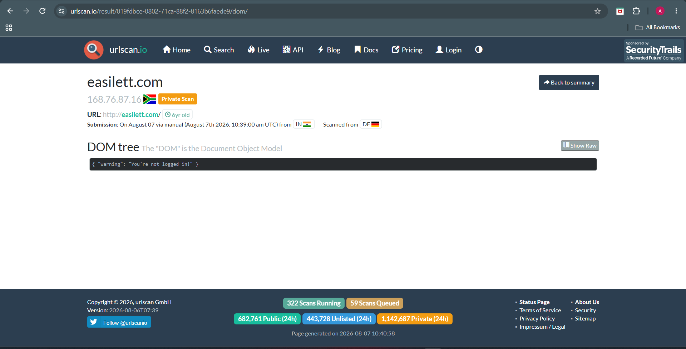

---

# 🛡️ Step 10 – Cisco Talos Reputation

Cisco Talos classified the domain reputation as:

```text
Neutral
```

No Talos blocklisting was observed.

Screenshot:


---

# 🚨 Step 11 – AbuseIPDB

The resolved IP address

```text
168.76.87.16
```

was checked using AbuseIPDB.

### Result

- No abuse reports.
- Confidence of Abuse: **0%**

Screenshot:

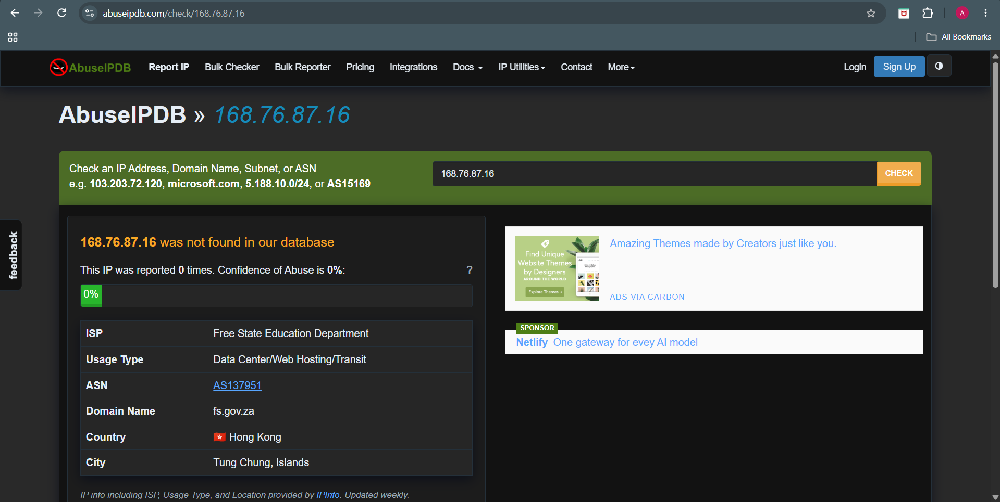

---

# 📊 Analysis Summary

| Indicator | Result |
|-----------|--------|
| Primary Suspicious Domain | easilett.com |
| Resolved IP Address | 168.76.87.16 |
| MX Record | Not Found |
| SPF Record | Missing |
| DMARC Record | Missing |
| VirusTotal | 1 / 91 flagged as phishing |
| Cisco Talos | Neutral |
| AbuseIPDB | No Reports |
| WHOIS | Newly Registered Domain |
| Overall Risk | **High** |

---

# 💡 Analyst Assessment

The domain **easilett.com** exhibits several characteristics commonly associated with phishing infrastructure.

Although only one VirusTotal vendor classified the domain as phishing and other reputation services reported limited intelligence, the technical evidence provides a stronger basis for assessment. The domain lacks SPF and DMARC protection, has no MX configuration, was recently registered, and is directly embedded within the PayPal-themed phishing email as the destination for hyperlinks and externally hosted resources.

When evaluated alongside the email content, sender analysis, and routing information, the infrastructure should be considered suspicious despite the limited public threat intelligence available.

---

# ✅ Conclusion

The URL and domain analysis identified **easilett.com** as the primary infrastructure supporting the phishing campaign.

Key observations include:

- Newly registered domain.
- Missing SPF and DMARC records.
- No legitimate mail configuration.
- Flagged as phishing by VirusTotal.
- Hosted on external infrastructure.
- Embedded throughout the PayPal-themed phishing email.

Although not all threat intelligence platforms classified the domain as malicious, the combination of weak DNS configuration, recent registration, and direct involvement in the phishing campaign provides **high confidence** that the domain is malicious and should be blocked.

**Final Verdict:** 🔴 **High Confidence Phishing Infrastructure**

---

# ➡️ Next Phase

Continue to **Phase 08 – Attachment Analysis** to determine whether the phishing email contains malicious attachments or relies solely on embedded content and external infrastructure.
