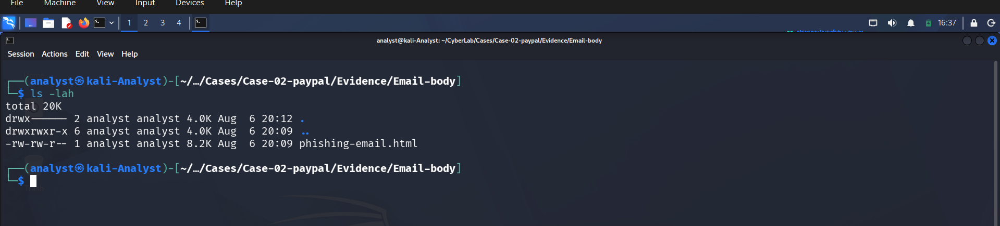
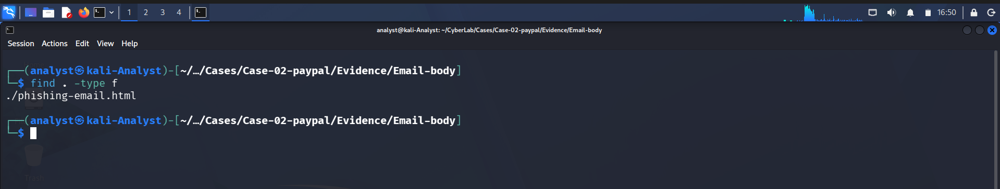

# Attachment Analysis

## Objective

The purpose of this phase is to determine whether the phishing email contains any malicious file attachments such as PDF documents, Microsoft Office files, archives, executables, or scripts that could be used to deliver malware.

---

## Methodology

The extracted email contents were examined using Linux command-line utilities. The investigation included:

- Listing extracted files
- Searching for common attachment types
- Reviewing MIME headers
- Checking for attachment-related headers

---

## Step 1 – List Extracted Files

The extracted email directory was inspected.

**Command**

```bash
ls -lah
```

### Result

Only one HTML file was extracted.

**Screenshot**



---

## Step 2 – Search for Attachments

A recursive search was performed.

**Command**

```bash
find . -type f
```

### Result

Only the HTML email body was present.

```
./phishing-email.html
```

**Screenshot**



---

## Step 3 – Search for Common Attachment Types

The following attachment types were searched:

- PDF
- Microsoft Word
- Microsoft Excel
- ZIP archives
- RAR archives
- Executable files
- JavaScript
- VBScript
- ISO images
- Windows shortcut files

Example:

```bash
find . -name "*.pdf"
find . -name "*.doc"
find . -name "*.xls"
find . -name "*.zip"
find . -name "*.exe"
```

### Result

No attachment files were identified.

**Screenshot**


---

## Step 4 – Check Content-Disposition

The email headers were inspected to determine whether any MIME attachment sections were present.

**Command**

```bash
grep -i "Content-Disposition" sample-1407.eml
```

An additional search for the keyword **attachment** was also performed.

```bash
grep -i "attachment" sample-1407.eml
```

### Result

No attachment-related headers were found.

**Screenshot**


---

## Step 5 – Verify MIME Content-Type

The MIME type of the email was examined.

**Command**

```bash
grep -i "Content-Type" sample-1407.eml
```

### Result

The email contains:

```
Content-Type: text/html; charset="UTF-8"
```

This confirms that the email consists solely of an HTML message body.

**Screenshot**


---

# Findings

| Item | Status |
|------|--------|
| HTML Email Body | ✅ Present |
| PDF Attachments | ❌ Not Found |
| Microsoft Office Documents | ❌ Not Found |
| ZIP Archives | ❌ Not Found |
| Executable Files | ❌ Not Found |
| JavaScript Attachments | ❌ Not Found |
| VBScript Files | ❌ Not Found |
| ISO Images | ❌ Not Found |
| Windows Shortcut Files | ❌ Not Found |
| MIME Attachments | ❌ Not Present |

---

# Conclusion

The investigation confirmed that the phishing email does **not** contain any file attachments or embedded malware payloads. The email is composed entirely of an HTML message (`text/html`) and does not include MIME attachment sections such as `Content-Disposition: attachment`.

Instead of distributing malware through attached files, the threat actor attempts to compromise victims by embedding malicious hyperlinks within the HTML content. This behavior is characteristic of a **credential harvesting phishing campaign**, where users are redirected to external websites designed to steal sensitive information rather than execute malicious files.

---
