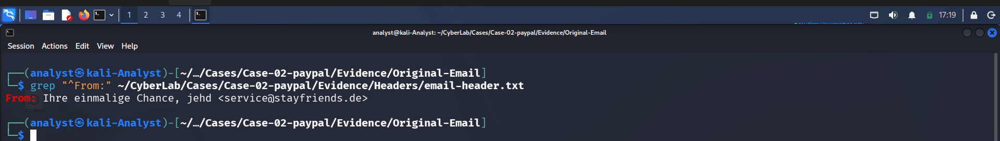
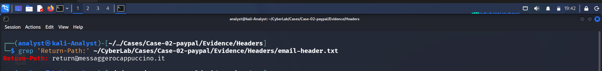
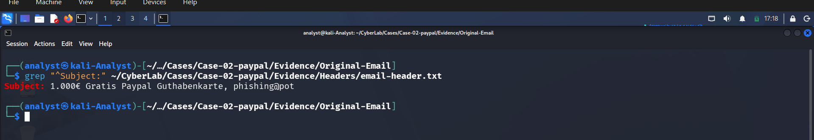
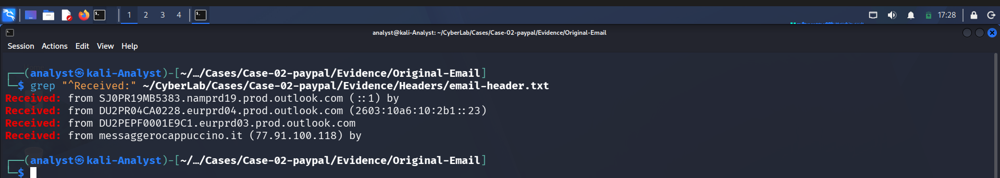
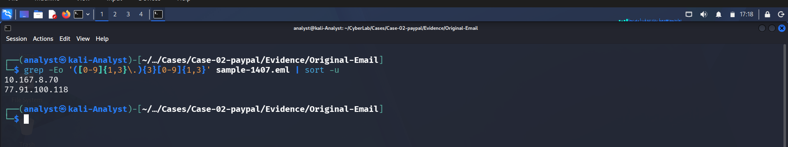
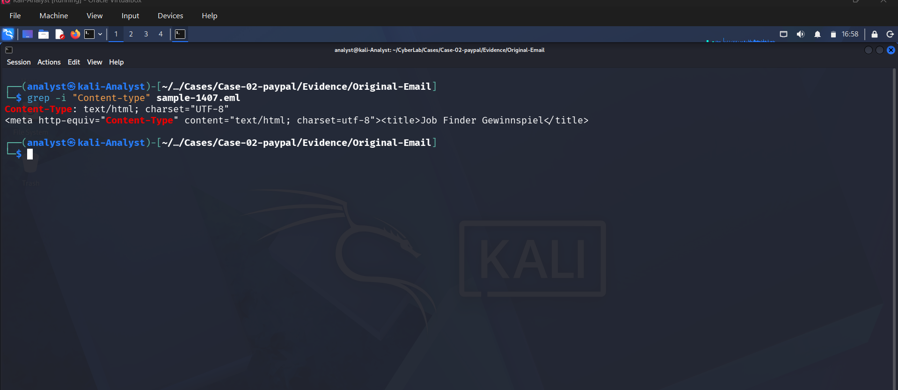

# 🎯 Phase 09 – IOC Extraction


---

# 📖 Overview

The purpose of this phase was to identify and document all Indicators of Compromise (IOCs) extracted during the phishing email investigation. These indicators represent observable artifacts associated with the phishing campaign and can be used for threat hunting, detection engineering, incident response, and defensive security controls.

The extracted IOCs include email addresses, domains, IP addresses, URLs, email metadata, and message characteristics identified throughout the investigation.

---

# 🎯 Objectives

The objectives of this phase were to:

- Extract indicators from the phishing email.
- Identify suspicious email addresses and domains.
- Document originating IP addresses.
- Record email metadata useful for detection.
- Differentiate malicious and legitimate infrastructure.
- Produce a consolidated IOC list for future investigations.

---

# 📊 IOC Summary

| IOC Type | Value | Assessment |
|----------|-------|------------|
| Sender Email | `service@stayfriends.de` | Suspicious |
| Return-Path | `return@messaggerocappuccino.it` | Suspicious |
| Reply-To | Not Present | Informational |
| Subject | `1.000€ Gratis Paypal Guthabenkarte, phishing@pot` | Social Engineering |
| Source IP | `77.91.100.118` | Suspicious |
| Internal Relay IP | `10.167.8.70` | Internal Infrastructure |
| Domain | `easilett.com` | Suspicious |
| Domain | `fonts.googleapis.com` | Legitimate |
| Attachment | None | No Attachment Found |
| MIME Type | `text/html` | HTML Email |
| Message-ID | Not Present | Informational |

---

# 📧 Sender Email

The sender address was extracted from the email header.

### Command

```bash
grep "^From:" ~/CyberLab/Cases/Case-02-paypal/Evidence/Headers/email-header.txt
```

### Output

```
service@stayfriends.de
```

### Screenshot



### Observation

The sender claims to originate from **stayfriends.de**, a domain unrelated to PayPal. Although the sender successfully passed SPF authentication, the sender address does not match the brand being impersonated, making it suspicious.

---

# 📨 Return-Path

The Return-Path identifies the SMTP envelope sender used during email delivery.

### Command

```bash
grep "^Return-Path:" ~/CyberLab/Cases/Case-02-paypal/Evidence/Headers/email-header.txt
```

### Output

```
return@messaggerocappuccino.it
```

### Screenshot



### Observation

The Return-Path domain differs from the visible sender address. Although different Return-Path domains may occur in legitimate email delivery, this discrepancy is commonly observed in phishing campaigns and should be correlated with authentication and routing analysis.

---

# 📩 Reply-To Header

The Reply-To header was examined to determine whether replies would be redirected to another mailbox.

### Command

```bash
grep "^Reply-To:" ~/CyberLab/Cases/Case-02-paypal/Evidence/Headers/email-header.txt
```

### Result

No Reply-To header was present.

### Observation

This phishing email does not attempt to redirect replies using a Reply-To header. Replies would therefore default to the address specified in the **From** header.

---

# 📨 Email Subject

The subject line was extracted from the email header.

### Command

```bash
grep "^Subject:" ~/CyberLab/Cases/Case-02-paypal/Evidence/Headers/email-header.txt
```

### Output

```
1.000€ Gratis Paypal Guthabenkarte, phishing@pot
```

### Screenshot




### Observation

The subject uses a financial reward and urgency-based social engineering to entice recipients into opening the email and interacting with its embedded hyperlinks.

---

# 🆔 Message-ID

The Message-ID field was examined.

### Command

```bash
grep "^Message-ID:" ~/CyberLab/Cases/Case-02-paypal/Evidence/Headers/email-header.txt
```

### Screenshot


### Observation

No visible Message-ID value was identified within the extracted header. Although uncommon, this observation was documented as part of the forensic investigation.

---

# 🌐 Received Headers

The routing headers were reviewed to identify the originating infrastructure.

### Command

```bash
grep "^Received:" ~/CyberLab/Cases/Case-02-paypal/Evidence/Headers/email-header.txt
```

### Screenshot



### Observation

Routing analysis identified the following infrastructure:

- External Source IP: **77.91.100.118**
- Internal Relay IP: **10.167.8.70**
- Originating Domain: **messaggerocappuccino.it**

The external IP address represents the originating SMTP infrastructure responsible for delivering the phishing email.

---

# 🌍 Extracted IP Addresses

IP addresses were extracted from the original email.

### Command

```bash
grep -Eo '([0-9]{1,3}\.){3}[0-9]{1,3}' sample-1407.eml | sort -u
```

### Screenshot



### Extracted IPs

- 77.91.100.118
- 10.167.8.70

### Observation

The external IP (**77.91.100.118**) is considered the primary IOC associated with the phishing campaign, while **10.167.8.70** belongs to Microsoft's internal mail infrastructure and is considered informational.

---

# 🔗 URL Extraction

Embedded URLs were extracted from the HTML email body.

### Screenshot


### Observation

Both legitimate and suspicious URLs were identified.

Extracted resources include:

- https://fonts.googleapis.com/
- http://easilett.com/

The Google Fonts URL is a legitimate resource used only for rendering the HTML email.

The **easilett.com** domain is unrelated to PayPal and was identified as the primary phishing infrastructure.

---

# 🌍 Domain Extraction

Domains were extracted from the identified URLs.

### Screenshot


### Extracted Domains

- easilett.com
- fonts.googleapis.com

### Observation

Two domains were identified.

**easilett.com**

- Unrelated to PayPal
- Embedded throughout the phishing email
- Used as phishing infrastructure
- Investigated using WHOIS, DNS, VirusTotal, URLScan.io, Cisco Talos, MXToolbox, and AbuseIPDB

**fonts.googleapis.com**

- Legitimate Google service
- Used only for loading web fonts
- Not considered malicious

---

# 📎 Attachment Check

The email was examined for file attachments.

### Screenshot


### Observation

No attachments were identified.

The phishing campaign relies entirely on HTML content and embedded hyperlinks rather than malicious files.

---

# 📄 MIME Type

The email Content-Type header was examined.

### Screenshot



### Result

```
text/html
charset=UTF-8
```

### Observation

The phishing email consists entirely of HTML content and contains no attached files.

---

# 📋 IOC Summary

| IOC | Classification |
|------|----------------|
| `service@stayfriends.de` | Suspicious Sender |
| `return@messaggerocappuccino.it` | Suspicious Return-Path |
| `77.91.100.118` | Suspicious External IP |
| `easilett.com` | Suspicious Domain |
| `fonts.googleapis.com` | Legitimate Domain |
| HTML Email | Email Format |
| No Attachment | Verified |

---

# 💡 Analyst Assessment

The IOC extraction phase successfully identified multiple indicators associated with this phishing campaign. The most significant indicators include the suspicious sender infrastructure, the originating external IP address, and the phishing domain **easilett.com**, which was embedded throughout the HTML email.

Although the email passed SPF and DMARC authentication, the collected IOCs demonstrate that authentication alone is insufficient to establish legitimacy. Correlating these indicators with the sender analysis, routing information, content analysis, and threat intelligence provides a higher level of confidence that the email is part of a credential harvesting campaign.

The extracted IOCs should be retained for threat hunting, SIEM detection rules, email filtering, firewall blocking, and future incident response activities.

---

# ✅ Conclusion

The IOC extraction phase successfully documented all observable indicators associated with this phishing campaign.

The primary IOCs include:

- **Sender Email:** `service@stayfriends.de`
- **Return-Path:** `return@messaggerocappuccino.it`
- **External Source IP:** `77.91.100.118`
- **Suspicious Domain:** `easilett.com`

Additional observations include the use of a legitimate Google-hosted font service (`fonts.googleapis.com`) for rendering the HTML email and the absence of file attachments, indicating that the phishing campaign relied entirely on social engineering and malicious hyperlinks rather than malware delivery.

These indicators provide valuable intelligence for detection engineering, threat hunting, and defensive security operations.

---

# ➡️ Next Phase

Continue to **Phase 10 – Threat Intelligence** to validate the extracted indicators using external threat intelligence platforms and determine whether they are associated with known phishing campaigns or malicious infrastructure.
