# 🛰️ Phase 10 – Threat Intelligence Analysis


---

# 📖 Overview

The purpose of this phase is to validate the Indicators of Compromise (IOCs) extracted during the previous phases of the investigation by leveraging multiple Threat Intelligence and Open-Source Intelligence (OSINT) platforms.

Each identified domain and IP address is analyzed to determine its reputation, ownership, infrastructure, and potential association with phishing or other malicious activities. The intelligence gathered during this phase provides additional context that helps determine whether the extracted indicators are trustworthy, suspicious, or malicious.

---

# 🎯 Objectives

The objectives of this phase are to:

- Validate the extracted Indicators of Compromise (IOCs).
- Investigate suspicious domains and IP addresses.
- Verify domain ownership and registration details.
- Analyze infrastructure using public OSINT platforms.
- Correlate intelligence findings with previous forensic analysis.
- Assess the overall credibility of the phishing infrastructure.

---

# 🛠️ Intelligence Sources

The following Threat Intelligence platforms were used during this investigation.

| Platform | Purpose |
|----------|---------|
| VirusTotal | Reputation analysis of domains and IP addresses |
| URLScan.io | Website behavior and infrastructure analysis |
| Cisco Talos Intelligence | Domain and IP reputation lookup |
| AbuseIPDB | Abuse reports for IP addresses |
| WHOIS | Domain registration information |
| MXToolbox | DNS, MX, SPF, and DMARC analysis |

---

# 🔍 Investigated Indicators

| Indicator | Type |
|-----------|------|
| easilett.com | Domain |
| stayfriends.de | Sender Domain |
| messaggerocappuccino.it | Return-Path Domain |
| 77.91.100.118 | Source IP Address |

---

# 🌐 Domain Investigation – easilett.com

## Objective

During URL extraction, the phishing email contained a hyperlink pointing to **easilett.com**. Since phishing campaigns commonly direct victims to attacker-controlled websites, the domain was investigated to determine its legitimacy, reputation, hosting information, and associated infrastructure.

---

# VirusTotal Analysis

The domain was submitted to VirusTotal for reputation analysis.

### Screenshot


### Observation

VirusTotal reported that **1 out of 91 security vendors** classified the domain as phishing, while the remaining vendors did not detect malicious activity.

Although the overall detection rate is low, even a single phishing detection is significant because phishing domains are often short-lived and may evade detection shortly after registration.

---

### Detection Details


### Observation

The detection results indicate:

- Detection Ratio: **1 / 91**
- Fortinet classified the domain as **Phishing**
- Most other security vendors currently classify the domain as clean

This mixed reputation suggests that the domain may represent newly emerging phishing infrastructure.

---

### Infrastructure Relationships


### Observation

The Relations tab revealed historical passive DNS information and infrastructure associated with the domain.

The domain has resolved to multiple IP addresses over time, indicating infrastructure changes commonly observed with newly registered or short-lived websites.

---

# URLScan.io Analysis

The domain was investigated using URLScan.io to observe its behavior, page content, and infrastructure.

### Summary

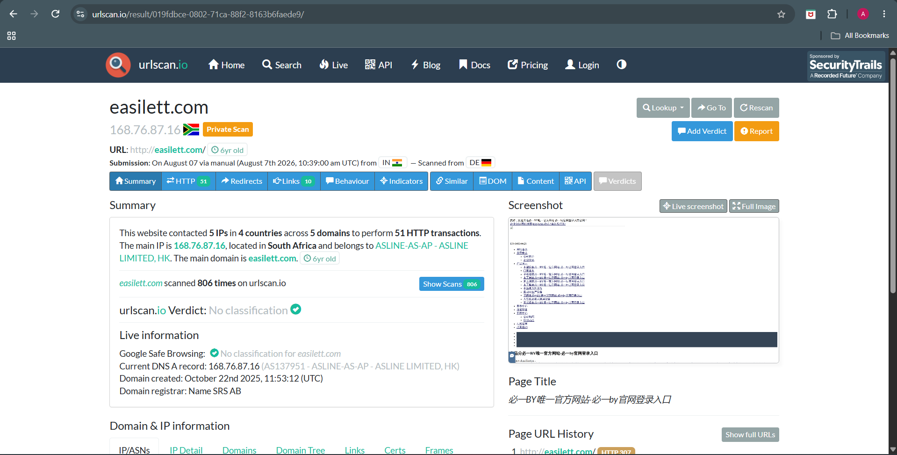

### Observation

URLScan successfully rendered the webpage and identified the domain as active.

Key observations include:

- The website completed multiple HTTP requests during analysis.
- The webpage displayed foreign-language content unrelated to PayPal.
- The main server IP resolved to **168.76.87.16**.
- The domain has been observed multiple times on URLScan, indicating that it has been publicly analyzed before.

Although the page does not directly imitate PayPal, it is unrelated to the phishing email and therefore remains suspicious.

---

### Outgoing Links

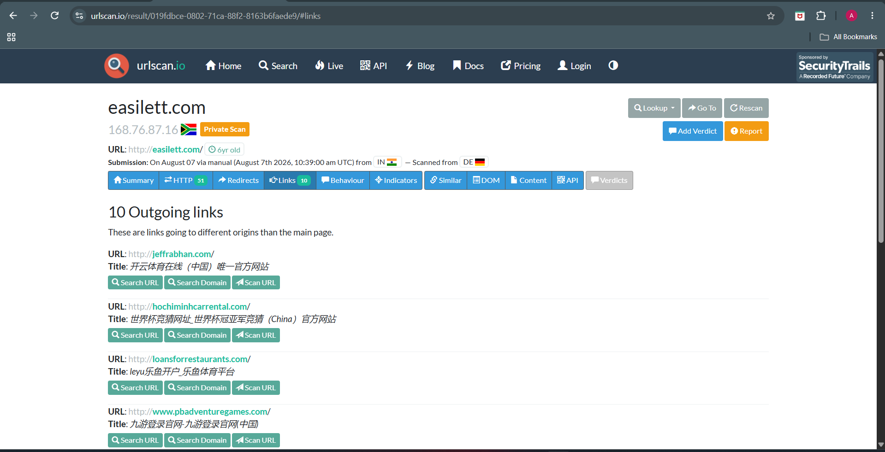

### Observation

URLScan identified multiple outbound links pointing to unrelated external websites.

The presence of numerous outbound links that are unrelated to the phishing theme suggests that the domain may be hosting unrelated or potentially compromised content rather than a legitimate PayPal service.

---

### DOM Analysis


### Observation

DOM inspection was attempted during the investigation.

The scan returned limited information because URLScan restricts DOM visibility for anonymous users.

Even though complete DOM details were unavailable, the scan confirmed that the webpage was reachable and actively serving content.

---

# WHOIS Analysis

The domain registration information was collected using the Linux `whois` utility.

```bash
whois easilett.com > ~/CyberLab/Cases/Case-02-paypal/Artifacts/URL-Analysis/whois.txt
cat ~/CyberLab/Cases/Case-02-paypal/Artifacts/URL-Analysis/whois.txt
```

### Screenshot

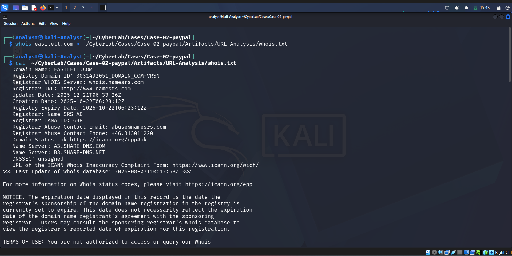

### Observation

WHOIS analysis revealed:

- Domain Name: **easilett.com**
- Registrar: **Name SRS AB**
- Creation Date: **2025-10-22**
- Expiration Date: **2026-10-22**
- Status: **ok**
- Dedicated authoritative name servers are configured.

The domain is relatively new, which is a common characteristic observed in phishing campaigns that frequently use recently registered infrastructure.

---

# Cisco Talos Reputation

Cisco Talos was used to evaluate the domain's reputation.

### Screenshot

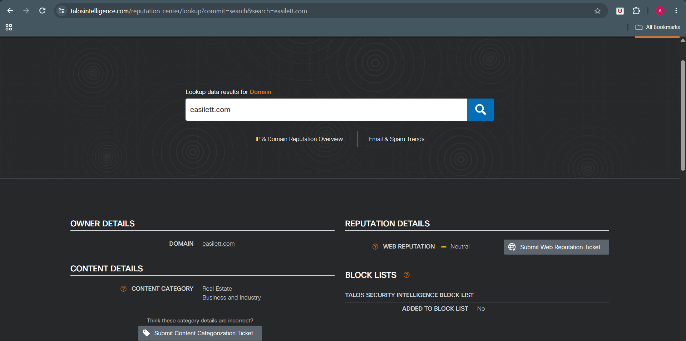

### Observation

Cisco Talos classified the domain with a **Neutral** web reputation.

No established malicious reputation was identified at the time of analysis.

However, a neutral reputation should not automatically be considered safe, especially when the domain is directly associated with phishing activity.
# AbuseIPDB Analysis

The resolved IP address associated with **easilett.com** was investigated using AbuseIPDB.

### Screenshot


### Observation

The IP address currently has:

- **0 Public Abuse Reports**
- **0% Abuse Confidence Score**
- Hosted by a commercial hosting provider.

Although no abuse reports were available at the time of analysis, newly deployed phishing infrastructure frequently accumulates little or no public reputation before being abandoned. Consequently, the absence of abuse reports should not be interpreted as evidence that the infrastructure is trustworthy.

---

# MXToolbox Analysis

The domain was further examined using MXToolbox to validate its DNS and email security configuration.

### MX Record


### Observation

No MX record was configured for **easilett.com**.

This indicates that the domain is not configured to receive email, which is unusual for legitimate business domains but commonly observed in phishing infrastructure used solely for hosting malicious web content.

---

### SPF Record


### Observation

No SPF record was identified.

Without an SPF policy, the domain does not define which mail servers are authorized to send email on its behalf, increasing the potential for email spoofing.

---

### DMARC Record

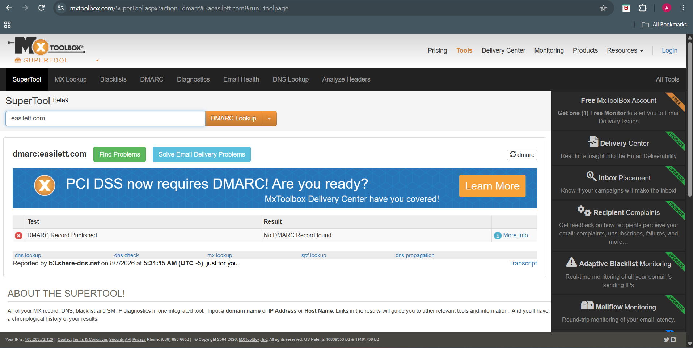

### Observation

No DMARC policy was configured.

The absence of a DMARC policy weakens email authentication and is commonly observed in domains that are not intended for legitimate email communication.

---

# Analyst Assessment

The investigation of **easilett.com** identified several characteristics commonly associated with phishing infrastructure.

Although only one VirusTotal vendor currently classifies the domain as phishing, the overall technical evidence strengthens the assessment that the domain is malicious.

Key observations include:

- Recently registered domain.
- Embedded directly within the phishing email.
- Hosted externally from legitimate PayPal infrastructure.
- Missing SPF and DMARC records.
- Limited but notable threat intelligence detections.
- Used as the destination for phishing hyperlinks.

When correlated with the email content and routing analysis, **easilett.com** represents the strongest Indicator of Compromise identified during this investigation.

---

# 🌐 Sender Domain Investigation – stayfriends.de

The visible sender domain (**stayfriends.de**) was investigated to determine whether it had an established malicious reputation or represented legitimate infrastructure that may have been abused during the phishing campaign.

---

# VirusTotal Analysis

### Screenshot

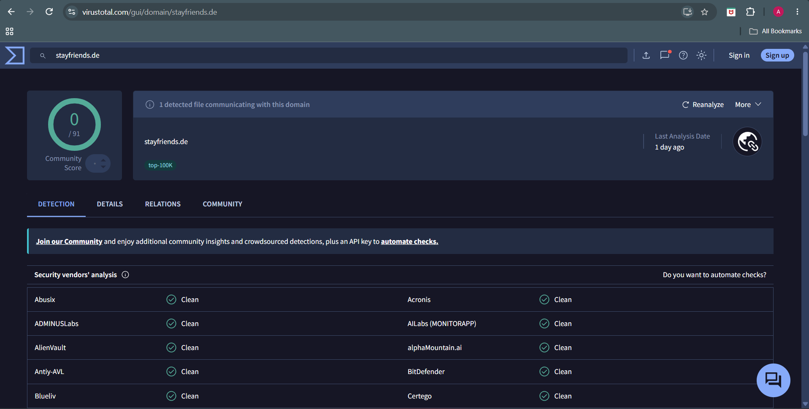

### Observation

VirusTotal reported no significant detections for **stayfriends.de**.

No major security vendors currently classify the domain as malicious.

The domain therefore maintains a generally favorable public reputation.

---

# Cisco Talos Analysis

### Screenshot

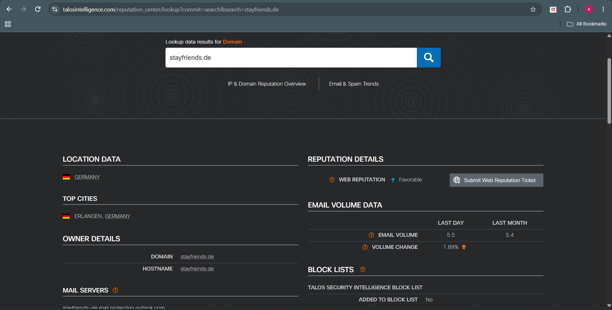

### Observation

Cisco Talos classified **stayfriends.de** with a **Neutral** reputation.

A neutral reputation should not be interpreted as proof that the domain is trustworthy. Reputation services frequently have limited visibility into compromised accounts or recently abused infrastructure.

---

# WHOIS Analysis

### Command

```bash
whois stayfriends.de
```

### Screenshot

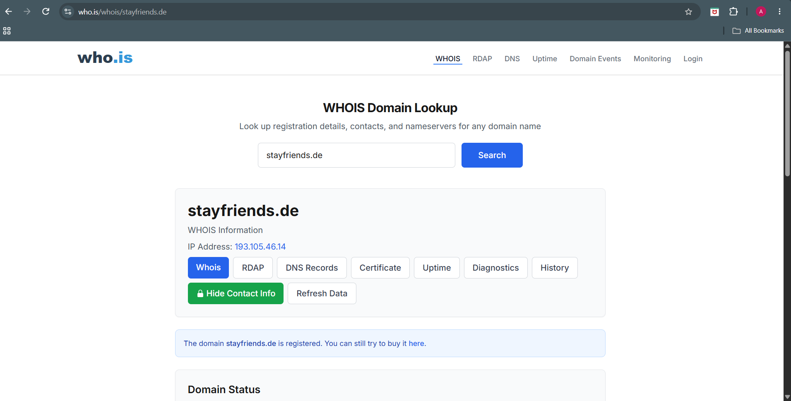

### Observation

WHOIS records confirm that **stayfriends.de** is a registered and publicly resolvable domain.

The registration information appears consistent with a legitimate domain.

However, legitimate domains can still be abused by threat actors to distribute phishing emails, particularly when legitimate accounts or mail infrastructure have been compromised.

---

# Analyst Assessment

Threat intelligence findings indicate that **stayfriends.de** itself does not currently exhibit characteristics commonly associated with malicious infrastructure.

The phishing email impersonated PayPal while using this domain as the visible sender address.

This suggests that the sender domain may represent legitimate infrastructure that was abused during the phishing campaign rather than infrastructure created specifically for malicious activity.

Accordingly, the sender domain should always be evaluated alongside authentication, routing, sender, and content analysis rather than in isolation.

---
# 🌐 Return-Path Domain Investigation – messaggerocappuccino.it

The Return-Path domain identified during the header analysis was investigated independently because it differs from the visible sender domain.

The Return-Path represents the SMTP envelope sender used during email delivery and often provides valuable insight into the actual infrastructure responsible for transmitting the message.

---

# WHOIS Analysis

### Command

```bash
whois messaggerocappuccino.it
```

### Screenshot

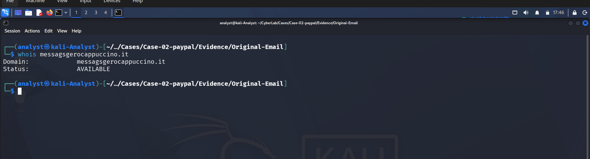

### Observation

WHOIS records confirm that **messaggerocuccino.it** is a registered and publicly resolvable domain.

Although the domain is legitimately registered, registration alone does not establish trustworthiness. Threat actors frequently register or abuse domains that appear legitimate to support phishing operations.

The Return-Path domain should therefore be evaluated together with the routing analysis, authentication results, and sender analysis rather than in isolation.

---

# VirusTotal Analysis

### Screenshot

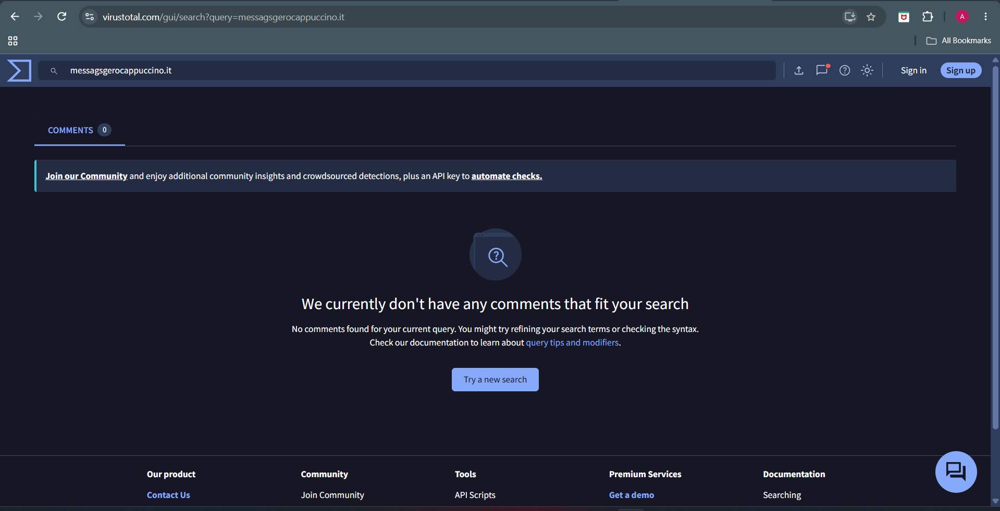

### Observation

VirusTotal reported limited intelligence for the Return-Path domain.

No significant detections were identified during the investigation.

The absence of detections should not be interpreted as evidence that the infrastructure is safe, particularly when the domain is directly associated with the SMTP delivery path of the phishing email.

---

# Cisco Talos Analysis

### Screenshot

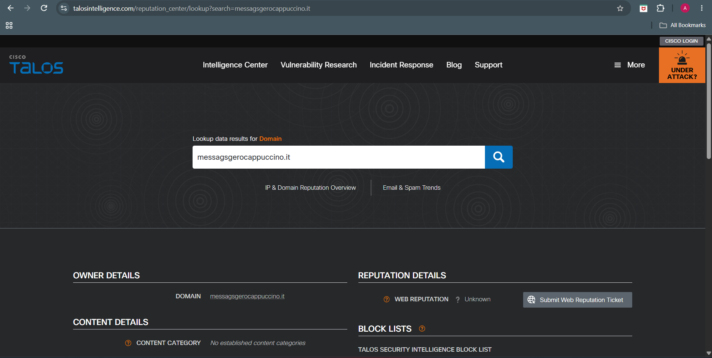

### Observation

Cisco Talos reported limited reputation information for the domain.

Newly registered or low-volume phishing infrastructure frequently has little or no reputation data available, making correlation with forensic evidence essential.

---

# Analyst Assessment

The Return-Path domain differs from the visible sender domain and represents the infrastructure responsible for SMTP delivery.

Although publicly available reputation services provide limited intelligence, the domain was directly observed within the email headers and therefore represents an important Indicator of Compromise.

When correlated with the routing analysis, the differing Return-Path strengthens the conclusion that separate infrastructure was used to deliver the phishing email.

---

# 🌍 Source IP Investigation – 77.91.100.118

The originating IP address identified during routing analysis was investigated using multiple Threat Intelligence platforms.

The objective was to determine whether the IP address had previously been associated with malicious activity or publicly reported abuse.

---

# AbuseIPDB Analysis

### Screenshot

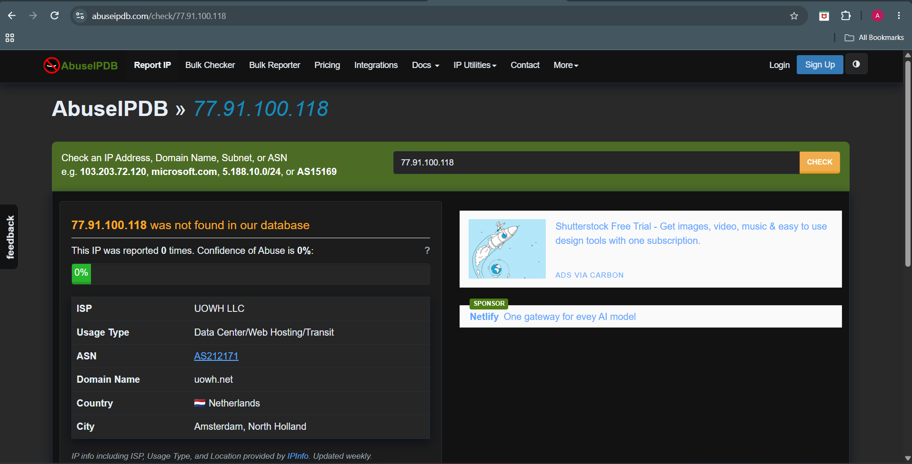

### Observation

AbuseIPDB reported the following:

- Abuse Confidence Score: **0%**
- Public Reports: **0**
- ISP: **UOWH LLC**
- Usage Type: **Data Center / Web Hosting / Transit**
- ASN: **AS212171**
- Country: **Netherlands**
- City: **Amsterdam**

Although no public abuse reports were available at the time of analysis, the IP address was directly observed transmitting the phishing email and therefore remains an important Indicator of Compromise.

---

# VirusTotal Analysis

### Screenshot

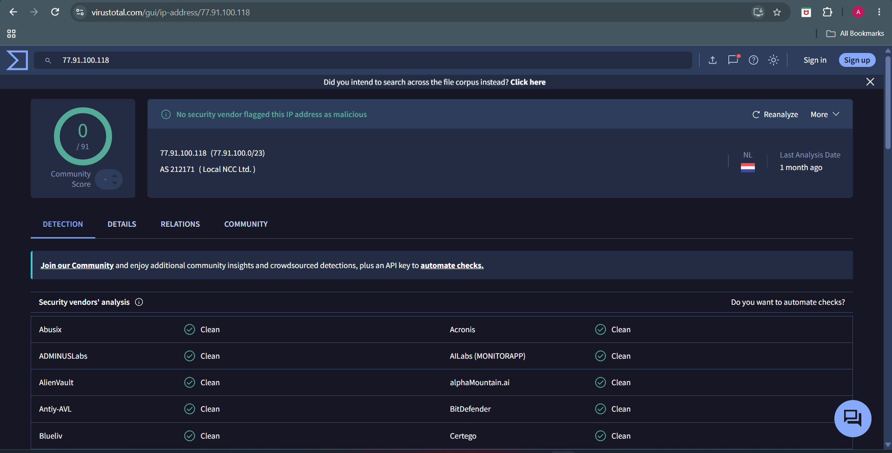

### Observation

VirusTotal reported no significant detections for the originating IP address.

While the IP address currently maintains a limited public reputation, this does not reduce its evidentiary value because it was extracted directly from the email headers.

---

# Cisco Talos Analysis

### Screenshot

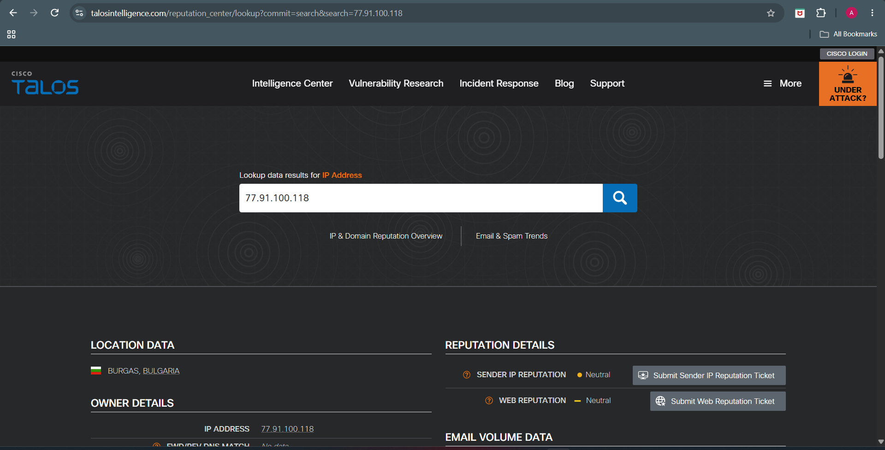

### Observation

Cisco Talos reported no significant reputation information for the originating IP address.

The absence of public reputation should not be interpreted as proof that the infrastructure is benign, particularly when the IP address participated directly in transmitting the phishing email.

---

# Analyst Assessment

Although the originating IP address currently has no public abuse reports, it remains a significant Indicator of Compromise because it was extracted directly from the email routing headers.

The IP belongs to commercial hosting infrastructure located in the Netherlands, a type of environment frequently leveraged for short-lived phishing campaigns.

Threat actors commonly use rented VPS or hosting providers that accumulate little or no public reputation before being abandoned.

---

# 📊 IOC Reputation Summary

| Indicator | Type | Reputation | Assessment |
|-----------|------|------------|------------|
| easilett.com | Domain | Mixed (1/91 VirusTotal Detection) | Suspicious Phishing Infrastructure |
| stayfriends.de | Sender Domain | Favorable | Legitimate Domain Possibly Abused |
| messaggerocappuccino.it | Return-Path Domain | Limited Reputation | Suspicious |
| 77.91.100.118 | Source IP | No Public Abuse Reports | Suspicious Hosting Infrastructure |

---

# 💡 Overall Threat Intelligence Assessment

The threat intelligence investigation indicates that the phishing campaign relied on a combination of legitimate and suspicious infrastructure.

The visible sender domain (**stayfriends.de**) appears to be a legitimate and publicly registered domain, suggesting that the attacker leveraged trusted infrastructure to increase the credibility of the phishing email.

The Return-Path domain (**messaggerocappuccino.it**) differs from the visible sender domain and was used during SMTP delivery, providing additional evidence that separate infrastructure was involved in transmitting the message.

The domain **easilett.com** emerged as the primary phishing infrastructure. It was embedded throughout the HTML email, hosted external resources, and redirected users away from legitimate PayPal services. Despite limited detections across public reputation platforms, the technical evidence collected throughout this investigation strongly supports classifying the domain as malicious.

Finally, the originating IP address (**77.91.100.118**) was extracted directly from the email headers. Although it currently has no public abuse reports, its role in transmitting the phishing email makes it an important Indicator of Compromise.

---

# ✅ Conclusion

The Threat Intelligence phase successfully validated the Indicators of Compromise identified throughout the investigation.

Although some public reputation services reported limited intelligence, the combined evidence from header analysis, routing analysis, sender analysis, authentication analysis, content analysis, URL analysis, and Threat Intelligence strongly supports the conclusion that this email represents a **credential harvesting phishing campaign**.

The campaign relied on trusted branding, separate SMTP infrastructure, and attacker-controlled web infrastructure to deceive recipients and redirect them to phishing resources.

The collected Indicators of Compromise can be used for:

- Threat Hunting
- SIEM Detection Rules
- Email Security Filtering
- DNS and Firewall Blocking
- Future Incident Response Activities

---

# ➡️ Next Phase

Continue to **Phase 11 – MITRE ATT&CK Mapping** to map the observed attacker behavior to the MITRE ATT&CK Enterprise framework and identify the tactics and techniques used throughout the phishing campaign.
