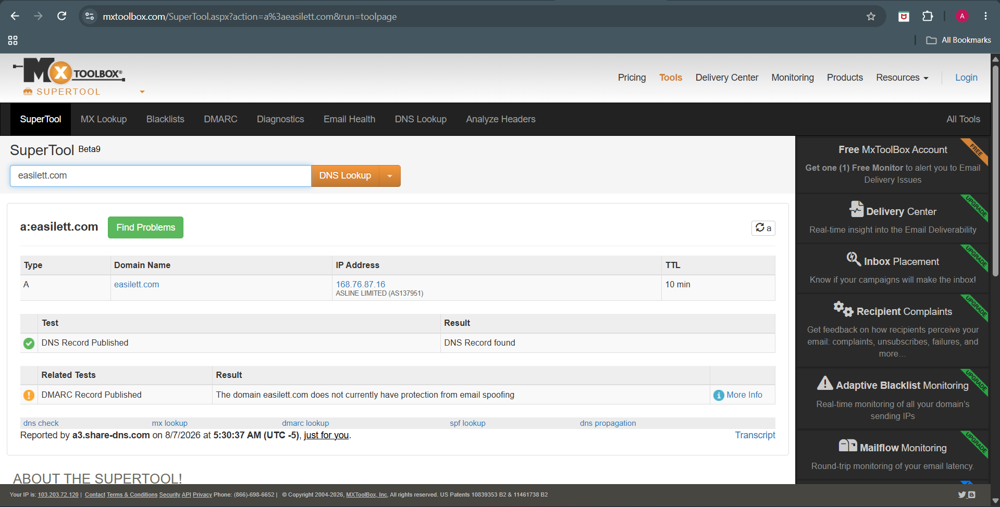

# Threat Intelligence Analysis

## Objective

The objective of this phase is to validate the Indicators of Compromise (IOCs) extracted during the previous investigation by leveraging multiple threat intelligence platforms. Each identified domain and IP address is analyzed using open-source intelligence (OSINT) services to determine its reputation, ownership, infrastructure, and potential association with phishing or malicious activity.

The intelligence gathered during this phase helps determine whether the extracted indicators are trustworthy, suspicious, or malicious, providing additional context for the phishing investigation.

---

# Intelligence Sources

The following threat intelligence platforms were used during this investigation:

| Platform | Purpose |
|----------|---------|
| VirusTotal | Reputation analysis of domains and IP addresses |
| URLScan.io | Website behavior and infrastructure analysis |
| Cisco Talos Intelligence | Domain and IP reputation lookup |
| AbuseIPDB | Abuse reports for IP addresses |
| WHOIS | Domain registration information |
| MXToolbox | DNS, MX, SPF and DMARC analysis |

---

# Investigated Indicators

| Indicator | Type |
|-----------|------|
| easilett.com | Domain |
| stayfriends.de | Sender Domain |
| messagsgerocappuccino.it | Return-Path Domain |
| 77.91.100.118 | Source IP Address |

---

# Domain Investigation – easilett.com

## Objective

During URL extraction, the phishing email contained a hyperlink pointing to **easilett.com**. Since users are encouraged to click embedded links in phishing campaigns, the domain was investigated to determine its legitimacy, reputation, hosting information, and associated infrastructure.

---

# VirusTotal Analysis

The domain was submitted to VirusTotal for reputation analysis.

### Screenshot


### Observation

VirusTotal reported that **1 out of 91 security vendors** classified the domain as phishing while the remaining vendors did not detect malicious activity.

Although the overall detection rate is low, even a single phishing detection is significant because phishing domains are often short-lived and may evade detection shortly after registration.

---

### Detection Details


### Observation

The detection results indicate:

- Detection Ratio: **1 / 91**
- Fortinet classified the domain as **Phishing**
- Most other security vendors currently classify the domain as clean

This mixed reputation suggests that the domain may represent newly emerging phishing infrastructure.

---

### Infrastructure Relationships


### Observation

The Relations tab revealed historical passive DNS information and infrastructure associated with the domain.

The domain has resolved to multiple IP addresses over time, indicating infrastructure changes commonly observed with newly registered or short-lived websites.

---

# URLScan.io Analysis

The domain was investigated using URLScan.io to observe its behavior, page content, and infrastructure.

### Summary


### Observation

URLScan successfully rendered the webpage and identified the domain as active.

Key observations include:

- The website completed multiple HTTP requests during analysis.
- The webpage displayed foreign-language content unrelated to PayPal.
- The main server IP resolved to **168.76.87.16**.
- The domain has been observed multiple times on URLScan, indicating that it has been publicly analyzed before.

Although the page does not directly imitate PayPal, it is unrelated to the phishing email and therefore remains suspicious.

---

### Outgoing Links


### Observation

URLScan identified multiple outbound links pointing to unrelated external websites.

The presence of numerous outbound links that are unrelated to the phishing theme suggests that the domain may be hosting unrelated or potentially compromised content rather than a legitimate PayPal service.

---

### DOM Analysis


### Observation

DOM inspection was attempted during the investigation.

The scan returned limited information because URLScan restricts DOM visibility for anonymous users.

Even though complete DOM details were unavailable, the scan confirmed that the webpage was reachable and actively serving content.

---

# WHOIS Analysis

The domain registration information was collected using the Linux `whois` utility.

```bash
whois easilett.com > ~/CyberLab/Cases/Case-02-paypal/Artifacts/URL-Analysis/whois.txt
cat ~/CyberLab/Cases/Case-02-paypal/Artifacts/URL-Analysis/whois.txt
```

### Screenshot


### Observation

WHOIS analysis revealed:

- Domain Name: **easilett.com**
- Registrar: **Name SRS AB**
- Creation Date: **2025-10-22**
- Expiration Date: **2026-10-22**
- Status: **ok**
- Dedicated authoritative name servers are configured.

The domain is relatively new, which is a common characteristic observed in phishing campaigns that frequently use recently registered infrastructure.

---

# Cisco Talos Reputation

Cisco Talos was used to evaluate the domain's reputation.

### Screenshot


### Observation

Cisco Talos classified the domain with a **Neutral** web reputation.

No established malicious reputation was identified at the time of analysis.

However, a neutral reputation should not automatically be considered safe, especially when the domain is directly associated with phishing activity.

---

# AbuseIPDB

The hosting IP associated with the domain (**168.76.87.16**) was investigated using AbuseIPDB.

### Screenshot


### Observation

AbuseIPDB reported:

- No abuse reports.
- Confidence of Abuse: **0%**
- No historical abuse records.

The absence of abuse reports does not confirm legitimacy because newly deployed phishing infrastructure may not yet have accumulated public abuse reports.

---

# MXToolbox Analysis

DNS infrastructure was validated using MXToolbox.

---

## DNS Records



### Observation

A valid DNS A record exists for the domain.

The domain currently resolves to:

- **168.76.87.16**

This confirms that the domain is active and reachable.

---

## MX Records


### Observation

No mail exchange (MX) records were identified for the domain.

The absence of MX records indicates that the domain is not configured to receive email directly.

---

## SPF Record


### Observation

No SPF record was found.

Without an SPF policy, the domain lacks sender authentication mechanisms that help prevent email spoofing.

---

## DMARC Record


### Observation

No DMARC record was configured.

The absence of DMARC means that there is no published policy instructing receiving mail servers how to handle spoofed emails using this domain.

---

# Analyst Assessment

The investigation identified several characteristics commonly associated with suspicious infrastructure:

- Recently registered domain.
- One security vendor classified the domain as phishing.
- Active DNS infrastructure.
- No SPF protection.
- No DMARC policy.
- Neutral reputation on Talos.
- No current abuse reports.

Although some reputation services have not yet classified the domain as malicious, its appearance within a phishing email combined with its infrastructure characteristics significantly increases its suspicion level.
---

# Sender Domain Investigation – stayfriends.de

## Objective

The visible sender email in the phishing message used the domain **stayfriends.de**. Although the email appeared to originate from this domain, it was necessary to verify whether the domain itself was malicious or whether it was being abused or spoofed by the attacker.

---

# VirusTotal Analysis

The sender domain was investigated using VirusTotal.

### Screenshot


### Observation

VirusTotal reported:

- **0 / 91** security vendors detected the domain as malicious.
- The domain appears in VirusTotal's **Top 100K** domains.
- No active phishing or malware detections were identified.

The reputation indicates that **stayfriends.de** is a legitimate and well-established domain.

---

# Cisco Talos Reputation

The sender domain was further verified using Cisco Talos Intelligence.

### Screenshot


### Observation

Cisco Talos classified the domain with a **Favorable** reputation.

Additional observations include:

- Positive web reputation.
- No blacklist entries.
- Active email infrastructure.
- Consistent email traffic.

These findings strongly indicate that the domain itself is legitimate.

---

# WHOIS Verification

WHOIS information was reviewed to confirm that the domain is actively registered.

### Screenshot


### Observation

WHOIS confirmed that the domain is currently registered and operational.

The registration information supports the conclusion that **stayfriends.de** is a legitimate organization and not an attacker-controlled phishing domain.

---

# Analyst Assessment

Although the phishing email displays an address from **stayfriends.de**, threat intelligence indicates that the domain itself is legitimate.

This suggests one of the following possibilities:

- Sender address spoofing.
- Abuse of a compromised email account.
- Unauthorized use of the legitimate domain for phishing.

The investigation found no evidence that **stayfriends.de** itself is malicious.

---

# Return-Path Domain Investigation – messagsgerocappuccino.it

## Objective

The Return-Path represents the SMTP envelope sender and often identifies the infrastructure actually responsible for delivering the email.

Unlike the visible sender address, attackers frequently use different Return-Path domains to hide their infrastructure.

---

# VirusTotal Analysis

The Return-Path domain was searched in VirusTotal.

### Screenshot


### Observation

VirusTotal returned very limited information for this domain.

No established reputation or historical intelligence was available, suggesting that the domain is either inactive, newly created, or has very limited public visibility.

---

# Cisco Talos Reputation

The Return-Path domain was investigated using Cisco Talos.

### Screenshot


### Observation

Cisco Talos reported:

- Reputation: **Unknown**
- No established content category.
- No significant reputation history.

Domains with unknown reputations frequently require additional investigation because they have not yet accumulated enough historical intelligence.

---

# WHOIS Analysis

The domain registration was verified using the Linux `whois` utility.

```bash
whois messagsgerocappuccino.it
```

### Screenshot


### Observation

WHOIS returned:

- Domain: **messagsgerocappuccino.it**
- Status: **AVAILABLE**

This indicates that the domain is currently **not registered**.

This finding suggests that the infrastructure used during the phishing campaign is no longer active, which is common for short-lived phishing operations.

---

# Analyst Assessment

The Return-Path domain differs completely from the visible sender domain.

Combined with its lack of reputation information and its current unregistered status, the Return-Path appears consistent with temporary phishing infrastructure that was likely abandoned after the campaign concluded.
# Source IP Investigation – 77.91.100.118

## Objective

The originating IP address extracted from the email headers was **77.91.100.118**.

The objective of this investigation was to determine whether the IP address had a known malicious reputation and to identify the hosting provider responsible for the infrastructure.

---

# AbuseIPDB Analysis

The IP address was investigated using AbuseIPDB.

### Screenshot


### Observation

AbuseIPDB reported the following:

- IP Address: **77.91.100.118**
- Abuse Confidence Score: **0%**
- Reports: **0**
- ISP: **UOWH LLC**
- Usage Type: **Data Center / Web Hosting / Transit**
- ASN: **AS212171**
- Country: **Netherlands**
- City: **Amsterdam**

No abuse reports were associated with this IP address at the time of analysis.

---

# VirusTotal Analysis

The IP address was also investigated using VirusTotal.

### Screenshot


### Observation

VirusTotal did not identify the IP address as malicious.

No security vendors reported active malicious activity associated with the IP during the investigation.

---

# Cisco Talos Reputation

Cisco Talos Intelligence was used to verify the IP reputation.

### Screenshot


### Observation

Cisco Talos reported no significant malicious reputation for the IP address.

The IP appears to belong to a hosting provider rather than a residential network.

---

# Analyst Assessment

Although the IP address currently has no public abuse reports, several characteristics make it noteworthy:

- Hosted by a commercial data center.
- Located in the Netherlands.
- Used for email transmission.
- Associated with phishing infrastructure through email header analysis.

Attackers commonly deploy temporary phishing servers on rented VPS or hosting providers. As a result, the absence of public abuse reports does not necessarily indicate that the IP was benign during the phishing campaign.

---

# IOC Reputation Summary

| Indicator | Type | Reputation | Assessment |
|-----------|------|------------|------------|
| easilett.com | Domain | Clean | Legitimate domain |
| stayfriends.de | Sender Domain | Favorable | Legitimate domain likely spoofed or compromised |
| messagsgerocappuccino.it | Return-Path Domain | Unknown / Unregistered | Suspicious |
| 77.91.100.118 | Source IP | No public abuse reports | Suspicious infrastructure |

---

# Final Analyst Conclusion

Threat intelligence investigation indicates that the phishing email relied on a combination of legitimate and suspicious infrastructure.

The sender domain (**stayfriends.de**) is a legitimate domain with a favorable reputation, suggesting that the attacker likely used sender spoofing or a compromised account to increase credibility.

The Return-Path domain (**messagsgerocappuccino.it**) showed no established reputation and is currently unregistered, indicating that it was likely a short-lived domain used exclusively for the phishing campaign.

The originating IP address (**77.91.100.118**) belongs to a commercial hosting provider in the Netherlands. Although it has no public abuse reports, its role in transmitting the phishing email and its association with hosting infrastructure make it relevant to the investigation.

Overall, the threat intelligence findings support the conclusion that the phishing campaign leveraged trusted domains to deceive recipients while hiding the actual sending infrastructure behind disposable infrastructure and temporary email routing.

The collected indicators provide valuable intelligence for future detection, email filtering, and incident response activities.
