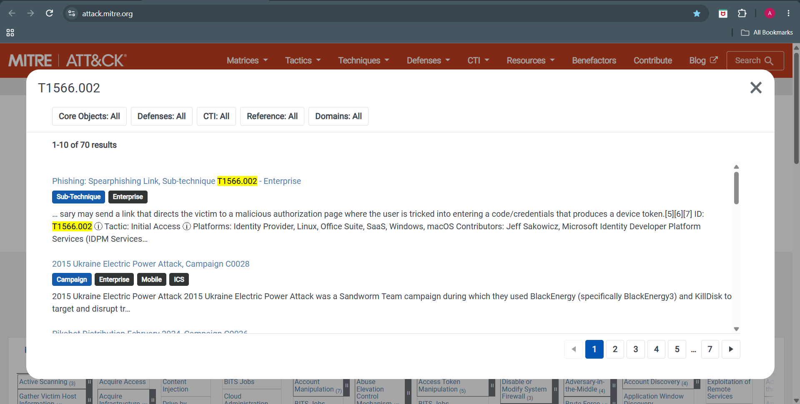
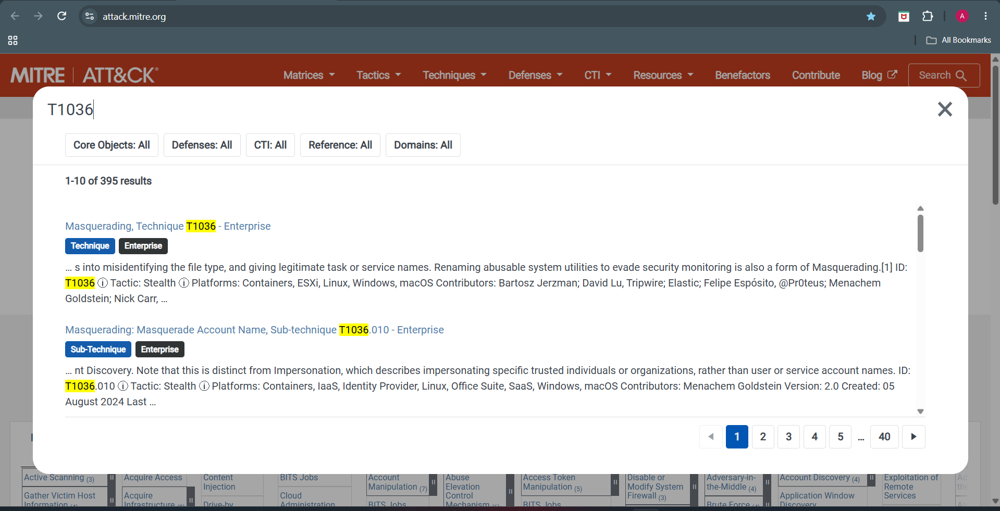
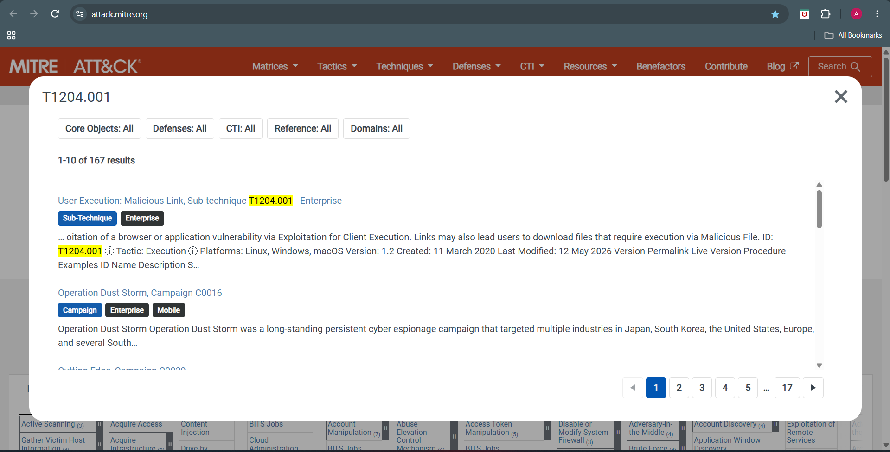

# 🛡️ Phase 11 – MITRE ATT&CK Mapping

---

# 📖 Overview

This phase maps the observed attacker behaviors identified during the phishing email investigation to the MITRE ATT&CK Enterprise Framework. Mapping these behaviors to standardized tactics and techniques helps security analysts better understand the attack lifecycle, improve detection capabilities, and align defensive strategies with known adversary behaviors.

---

# 🎯 Objectives

- Map the observed attacker behaviors to the MITRE ATT&CK Enterprise Framework.
- Identify the tactics and techniques used throughout the phishing campaign.
- Correlate investigation findings with standardized ATT&CK techniques.
- Document evidence supporting each mapped technique.
- Improve future detection, threat hunting, and defensive capabilities.

---

# ATT&CK Mapping Overview

The phishing campaign was analyzed against the MITRE ATT&CK Enterprise Matrix.

Based on the investigation, the attacker employed social engineering techniques, domain infrastructure, email impersonation, and malicious hyperlinks to lure victims into interacting with attacker-controlled infrastructure.

The following techniques were identified during the investigation.

| ATT&CK ID | Technique | Tactic | Status |
| --------- | ------------------------------- | -------------------- | ------------ |
| T1566 | Phishing | Initial Access | ✔ Identified |
| T1566.002 | Spearphishing Link | Initial Access | ✔ Identified |
| T1036 | Masquerading | Defense Evasion | ✔ Identified |
| T1204.001 | User Execution: Malicious Link | Execution | ✔ Identified |
| T1583.001 | Acquire Infrastructure: Domains | Resource Development | ✔ Observed |
| T1585.001 | Establish Accounts | Resource Development | ✔ Possible |

---

# Technique 1 – Phishing (T1566)

## Description

The investigation confirmed that the attacker attempted to gain initial access through a phishing email impersonating PayPal.

The email attempted to convince the recipient that they had won a PayPal gift card and encouraged interaction with embedded hyperlinks.

### Supporting Evidence

- Fake PayPal branding
- Social engineering
- HTML phishing email
- Suspicious sender infrastructure
- Malicious landing domain (easilett.com)

This behavior directly maps to **MITRE ATT&CK Technique T1566 – Phishing**.

---

# Technique 2 – Spearphishing Link (T1566.002)

## Description

The phishing email relied on embedded hyperlinks directing victims to attacker-controlled infrastructure.

Instead of delivering malware through attachments, the campaign attempted to redirect victims to an external phishing website.

### Screenshot

### Supporting Evidence

- HTML hyperlinks
- URL Analysis
- easilett.com investigation
- No malicious attachment
- Credential harvesting attempt

This behavior matches **MITRE ATT&CK Technique T1566.002 – Spearphishing Link**.

---

# Technique 3 – Masquerading (T1036)

## Description

The phishing campaign impersonated the PayPal brand to increase the likelihood that recipients would trust the email and interact with its content.

The email used:

- PayPal branding
- Financial reward lure
- Professional HTML formatting
- Legitimate-looking sender information

Although the sender domain (**stayfriends.de**) is legitimate, the email content falsely represented PayPal, making this a clear case of masquerading.

### Screenshot

### Supporting Evidence

- PayPal branding
- HTML email template
- Social engineering language
- Sender identity inconsistent with the claimed organization

This behavior aligns with **MITRE ATT&CK Technique T1036 – Masquerading**.

---

# Technique 4 – User Execution: Malicious Link (T1204.001)

## Description

The phishing campaign depended on user interaction.

Rather than exploiting a software vulnerability, the attacker relied on convincing the recipient to voluntarily click a malicious hyperlink embedded within the email.

### Screenshot

### Supporting Evidence

- Embedded phishing URL
- HTML hyperlink
- External phishing infrastructure
- No malware attachment
- User interaction required

This behavior maps directly to **MITRE ATT&CK Technique T1204.001 – User Execution: Malicious Link**.

---

# Technique 5 – Acquire Infrastructure: Domains (T1583.001)

## Description

The investigation identified **easilett.com** as the primary suspicious domain associated with the phishing campaign.

Threat intelligence analysis revealed:

- Active DNS records
- Newly registered infrastructure
- Missing SPF record
- Missing DMARC policy
- VirusTotal phishing detection

These findings indicate that the attacker acquired or controlled domain infrastructure to support the phishing operation.

### Supporting Evidence

- easilett.com
- WHOIS analysis
- MXToolbox analysis
- VirusTotal
- URLScan.io

This behavior aligns with **MITRE ATT&CK Technique T1583.001 – Acquire Infrastructure: Domains**.

---

# Technique 6 – Establish Accounts (T1585.001)

## Description

The phishing email was delivered using active email infrastructure and SMTP services.

The investigation identified:

- Sender email address
- Return-Path address
- SMTP routing infrastructure
- Multiple mail servers involved in delivery

Although there is no evidence that the attacker personally created these accounts, the use of email infrastructure to conduct phishing activity makes this technique a possible component of the campaign.

### Supporting Evidence

- Sender analysis
- Return-Path analysis
- Header analysis
- SMTP routing

This behavior is consistent with **MITRE ATT&CK Technique T1585.001 – Establish Accounts**.

---

# ATT&CK Technique Summary

| ATT&CK ID | Technique | Tactic | Evidence |
| --------- | ------------------------------- | -------------------- | ------------------------------------- |
| T1566 | Phishing | Initial Access | PayPal phishing email |
| T1566.002 | Spearphishing Link | Initial Access | Embedded phishing links |
| T1036 | Masquerading | Defense Evasion | Fake PayPal branding |
| T1204.001 | User Execution: Malicious Link | Execution | Victim required to click hyperlink |
| T1583.001 | Acquire Infrastructure: Domains | Resource Development | easilett.com |
| T1585.001 | Establish Accounts | Resource Development | Sender and Return-Path infrastructure |

---

# 💡 Analyst Assessment

The phishing campaign primarily relied on social engineering rather than malware delivery.

The attacker impersonated a trusted financial service, embedded malicious hyperlinks within an HTML email, and directed victims toward attacker-controlled infrastructure.

Unlike malware-based campaigns, this attack depended entirely on user interaction and credential theft rather than exploiting software vulnerabilities.

The MITRE ATT&CK mapping demonstrates that the campaign focused on **Initial Access** through phishing while using masquerading and attacker-controlled infrastructure to increase credibility.

---

# ✅ Conclusion

Mapping the investigation findings to the MITRE ATT&CK framework provides valuable insight into the attacker's tactics, techniques, and procedures (TTPs).

The mapped techniques demonstrate that the attacker relied primarily on social engineering, trusted branding, and attacker-controlled infrastructure rather than malware delivery or software exploitation.

The phishing campaign primarily leveraged social engineering, domain infrastructure, and malicious hyperlinks to achieve its objectives.

The identified ATT&CK techniques provide a standardized representation of the observed attacker behavior and can assist security teams in improving detection rules, threat hunting activities, and defensive strategies against similar phishing campaigns.

---

# ➡️ Next Phase

Continue to **Phase 12 – Risk Assessment** to evaluate the overall impact, likelihood, and severity of the phishing campaign based on the evidence collected throughout the investigation.
